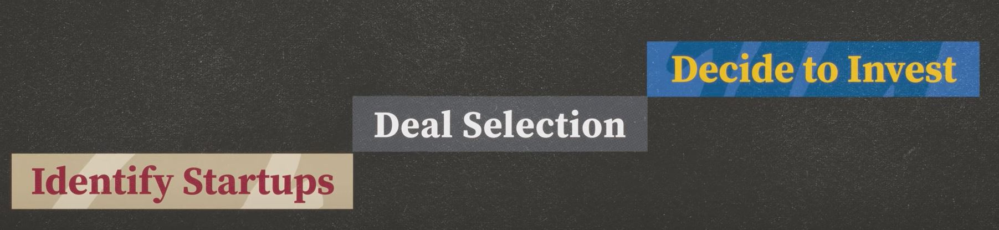

## VC Mindset

- Deal Selection (Most Important Stage)

    

## The Deal Funnel

On average, a hundred startups go into the deal funnel, and only one comes out, meaning that VCs invest in about one startup for each hundred that they consider.

- Stage 1 : The Business Model and the Idea

- Stage 2 : The Founding Team

- Stage 3 : The Partners

The highly selective process benefits us all down the line.
