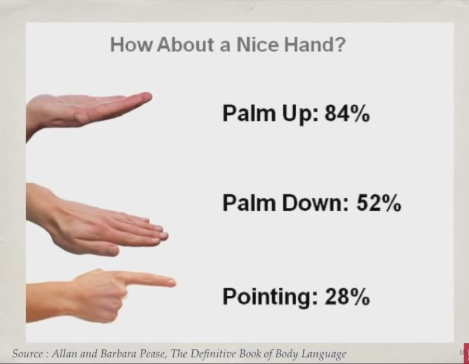

## 1. Great Tips for your body

- Posture breeds success
- Gestures strengthen our message
- The audience's body matters too!

## 2. Communication begins before you open mouth

## 3. Never use the fingers at your audience

