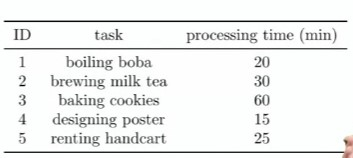

## 1. Resource allocation

- What is management?

- Someone said:
    - "Management is the attainment of organizational goals in an effective and eficient manner through planning, organizing, leading and controlling organizational resources" (Daft, 2014, p.7)

- What are resources in an organization?

- Setting an objective requires strategic thinking, experiences, vision, etc.

- "Resourrce allocation" uses Operations Research (OR)

- Names of similar subjects/ideas:
    - Management Science
    - Decision Science.
    - Optimization method/algorithm
    - Mathmatical Programming

- Let's see some examples.

## 2. Example: job allocation 

- Two people are going to hold an event, and they need to complete some tasks.

- One task must be assigned to exactly one person: one person can work on one task at a time.

- How to assign the tasks so that they can complete all tasks the fastest?

- What are the resources?

- What is the objective?

## 3. Example: Project Management

- `n` workers are going to complete `m` jobs in a project.

    - Some jobs must be processed with precedence rules.

    - Some jobs cannot be done by certain workers.

    - Some jobs can be split and allocated to several workers.

    - Some jobs require different processing time if allocated to different workers.

- How many days does it take to complete this project?

## 4. Industry Applications: Fedex

- Key decisions:
    
    - How to deliver 6.5 millions items to more than 220 countries each day?

    - In each region, where to tbuild distribution hubs?

    - In each distribution hubs, how to classify and sort items?

    - In each city, how to choose routes?

- What do you need?

    - Well-designed information systems.

    - Operations Research!

## 5. Industry Applications: Continental Airlines

- Key decisions:
    
    - How to determine the cities to connect?

    - How to schedule more than 2000 flights per day?

    - How to assign crews to flights?

    - How to reassign crews immediately when there is an emergency?

- What do you need?

    - Well-designed information systems.

    - Operations Research!
    
## 6. What is Operations Research?

- Operations Research (OR) is:

    - the methodology to "allocate the available resources to the various activities in a way that is most effective for the organization as a whole"

    - It is "appplieed to problems that concern how to conduct and coordinate the operations (i.e., activities) within an organization"

- It aims to support decision making

    - Typical tools: intuitions, business senses, and experiences.

    - And OR (and other quantitative tools)!

    - By doing OR studies, we generate some suggestions to decision makers.
    