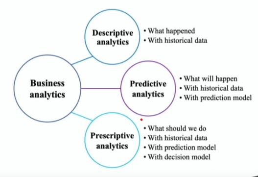

## 1. Business Analytics

- Today, everybody talks about business analytics.

- Master of business administration (MBA) becomes master of business analytics (or master of science in business analytics)

## 2. Operations Research / Mathmetical Programming

- A typical process of decision making with business analytics:

    - Data analysis: Collect information and understand the problem.

    - Operations research: Allocate resources and solve the problem.

## 3. Example: multi-product inventory

- How to set the inventory levels of multiple products to maximize the total expected profit?

- Suppose that there is only one product.

    - Prevent understocking or overstocking.

    - Data analysis: Estimate the random amoount of demand during one order cycle time.

    - Operations research: According to the random amount of demand, find the inventory level to maximize the expected profit.

    
- When we have multiple products:
    
    - Demand substitution: "There is no more Coke. How about Pepsi?"

- Data analysis is difficult

    - Estimate the probability of demand substitution between A and B, which is the probability for one to purchase B when A is sold out (or purchase A when B is sold out)

- Operations research is also difficult.

    - Given the substitution probabilities, find the best inventory levels of all products.

    