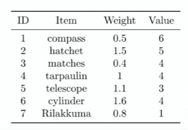

## 1. Example: knapsack problem

- You are preparing for hiking. There are some useful items, but your backpack (knapsack) can only carry 5 kilograms.

- An item cannot be split: Each item should be either chosen or discarded.

- Which item should you bring to maximize totoal value?

- Choosing items according to their weight-value ratios results in items 1,2 3, 4, and 5. The total value is 22.

- The optimal solution is to bring items 1, 2, 3, 4, and 6. The total value is 23.

- How may we model or formulate this problem?

## 2. Mathematical programming model

- Decision variables: What may we determine?

    - $x_i = 1$ if item `i` is chosen. 0 otherwise.

- Objective function: What do we want?

    - max $6x_1 + 5x_2 + 4x_3 + 3x_5 + 4x_6 + x_7$

- Constraints: What are the limitations?

    - $0.5x_1 + 1.5x2 + 0.4x_3 + x_4 + 1.1x_5 + 1.6x_6 + 0.8x_7 <= 5$

    and 

    - x_i <+>{0, 1}, i = 1, ..., 7

## 3. A compact formulation (advanced)

- Let $w_i$ and $v_i$ be the weight and value of item `i`

- Let $n$ be the number of items and B be the maximum allowable weight.

- A compact (and more abstract) formulation is 

    - max $\sum v_ix_i$

    - s.t $\sum w_ix_i <= B$

        - $x_i$ {0, 1}, i = 1, .., n