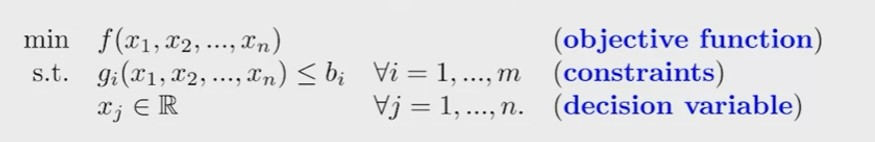
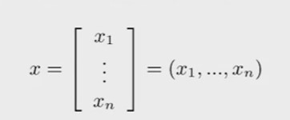
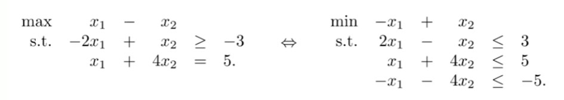

## 1. Linear Programs

- Linear Programming is the process of formulating and solving linear programs (also abbreviated as LPs).

- An LP is a mathematical program with some special properties.

- Let's first introduce some concepts of mathematical programs.

## 2. Basic elements of a program

- In general, any mathematical program may be expressed as 

    

    - There are $m$ constraints and $n$ variables

    - $x_1$, $x_2$, ..., $x_n$ are real-valued decision variables

    - We may write
     as a vector of decision variables (or a decision vector).

    - $f : R^n$ -> $R$ $g_i$ : $R^n$ -> $

    - Mostly we will omit $x_j \in R$.

## 3. Transformation

- How about a maximization objective function?

    - max $f(x)$ <=> min -$f(x)$

- How about "=" or ">=" constraints?

    - $g_i(x)$ >= $b_i$ <=> -$g_i(x)$ <= -$b_i$

    - $g_i(x)$ = $b_i$ <=> $g_i(x)$ <= $b_i$ and $g_i(x)$ >= $b_i$, i.e., -$g_i(x)$ <= -$b_i$.

- For example:

    

