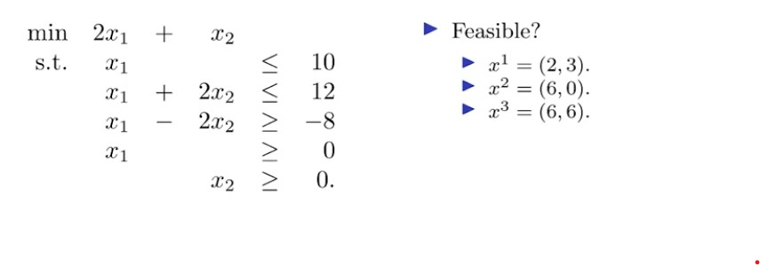
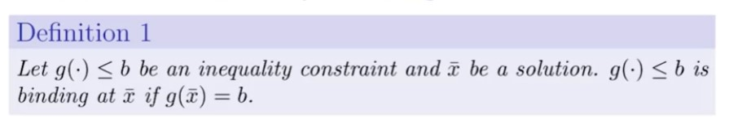

## 1. Sign constraints

- For some reasons that will be clear in the next week, we distinguish between two kinds of constraints:

    - Sign constraints: $x_i$ >= 0 or $x_i$ <= 0

    - Functional constraints: all others

- For a variable $x_i$:

    - It is nonnegative if $x_i$ >= 0 

    - It is nonpositive if $x_i$ <= 0 

    - It is unrestricted in sign (urs.) or free if it has no sign constraint.

## 2. Feasible solutions

- For a mathematical program:

    - A feasible solution satisfies all the constraints.

    - An infeasible solution violates at least one constraint.

- For example

    

## 3. Feasible region and optimal solutions

- The feasible region (or feasible set) is the set of feasible solutions

    - The feasible region may be empty.

- An optimal solution is a feasible solution that:
    
    - Attains the largest objective value for a maximization problem.

    - Attains the smallest objective value for a minimization problem.

    - In short, no feasible solution is better than it.

- An optimal solution may not be unique.

    - There may be multiple optimal solutions.

    - There may be no optimal solution.

## 4. Binding constraints

- At a solution, a constraint may be binding

    

    - An inequality is nonbinding at a point if it is strict at that point.

    - An equality constraint is always binding at any feasible solution.

- Some examples:

    - $x_1$ + $x_2$ < 10 is binding at ($x_1$ , $x_2$) = (2, 8)

    - $2x_1$ + $x_2$ >= 6 is nonbinding at ($x_1$, $x_2$) = (2, 8) 

    - $x_1$ + $3x_2$ = 9 is binding at ($x_1$, $x_2$) = (6, 1)

## 5. Strict constraints?

- An inequality may be strict or weak:

    - It is strict if the two sides cannot equal. E.g., $x_1$ + $x_2$ > 5.

    - It is weak if the two sides may be equal. E.g., $x_1$ + $x_2$ >= 5

- A "practical" mathematical program's inequalities are all weak.

    - With strict inequalities, an optimal solution may not be attainable!

    - With is an optimal solution of 

        - min $x$

        - s.t. $x$ > 0 ?

- Think about budget constraints.

    - You want to spend $500 to buy several things.
    - Typically, you cannot spend more than $500

    - But you may spend exactly $500.

