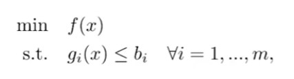
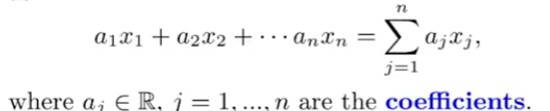
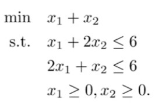
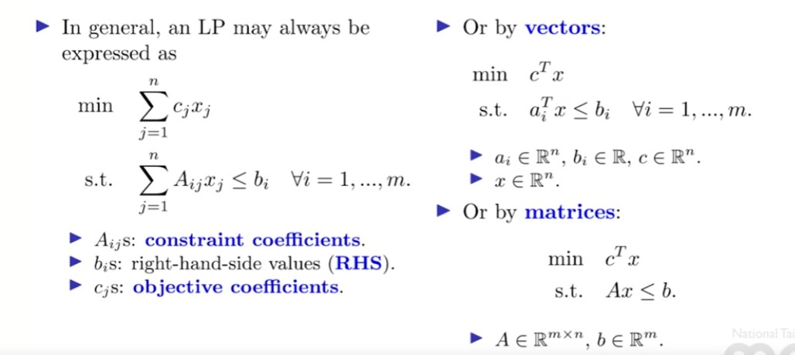

## 1. Linear Programs

- A mathematical program

    

    is an LP if $f$ and $g_i$ s are all linear functions.

    - Each of these linear functions may be expressed as 
    
    

    - We may write $a$ = ($a_1$, $a_2$, ..., $a_n$) and $f(x)$ = $a^Tx$

- An example

    
    

- In general, an LP may always be expressed as 

    
