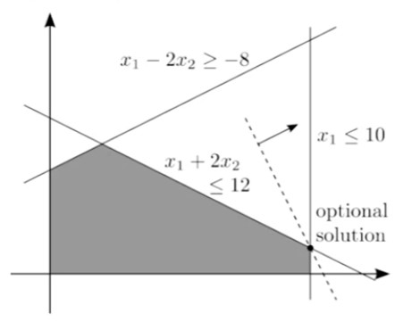

## 1. Graphical approach

- Step 1 : Draw the feasible region.

    - Draw each constraint one by one, and then find the intersection.

    

- Step 2 : Draw some isoquant lines

    - A line such that all point on it result in the same objective value.

    - Also called isoprofit or isocost lines when it is appropriate.

    - Also called indifference lines (curves) in Economics.

    

- Step 3 : Indicate the direction to push the isoquant line.

    - The direction that decreases/increases the objective value for minimization/maximization problem.
    
    

- Step 4 : Push the isoquant line to the "end" of the feasible region.

    - Stop when any further step make all points on the isoquant line infeasible.

    

- Step 5 : Identify the binding constraints at an optimal solution

    

- Step 6 : Set the binding constraints to equalities and then solve the linear system for an optimal solution

    - In the example, the binding constraints are $x_1$ <= 10 and $x_1$ + $2x_2$ <= 12

    - We may solve the linear program

        - $x_1$ = 10 

        - $x_1$ + $2x_2$ = 12 

        in any way and obtain an optimal solution ($x_1^*$, $x_2^*$) = (10, 1)

    - For example, through Gaussian elimination:

        

- Step 7 : plug in an optimal solution obtained into the objective function to get the associated objective value.

    - Int he example, $2x_1^*$ + $x_2^*$ = 21

## 2. Where to stop pushing?

- Where we push the isoquant line, where will be stop at?

- Intuitively, we always stop at a "corner" (or an edge)

    

- Is this intuition still true for LPs with more than two variables? Yes!

    - A more rigorous definition of "corner" exists.

    