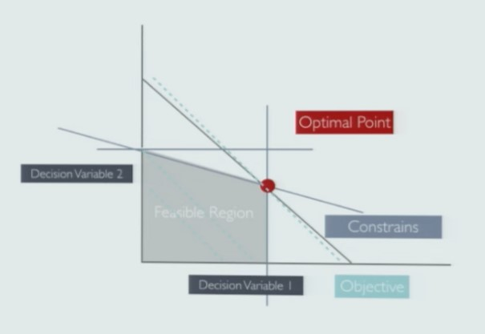
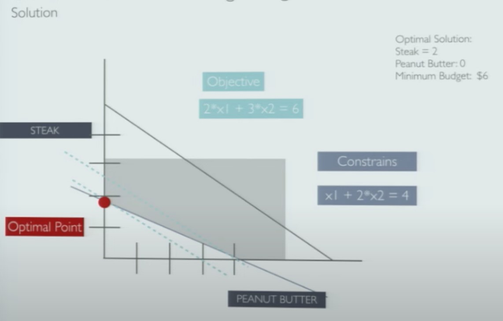

## 1. Introducing Simplex

- Optimizing decisions since 1947 by George Dan

- The journal Computing in Science and Engineering listed Simplex as one of the top 10  algorithms of the twentieth century.

- Used to solve linear problems.

## 2. Linear Programming : Applications

- Routing & Logistics

    - Finding optimal transportation (while minimizing the cost of transportation) to move merchandize between multiple warehouses and retail locations.

- Financial Planning

    - Allocating specific sums of money across portfolio while maximizing for potential return 

- Manufacturing

    - Drilling order in circuit boards to minimize the total distance the drill must be moved

- Product Mix
    
    - Decisions on how many products to produce (raw materials + labor distributions) while maximizing the revenue from products or satisfying the demand

## 3. Excel Solvers

- Good luck installing Solver on a Mac
- Excel limits you only to 200 variables.
- Hard to integrate with Other Systems/Applications
- Running in Production is not an option

## 4. Crash Course in Linear Programming

### 4-1. 3 Components of LP

1. Decision Variables

    - Number of things/Quantities to decide on

        - "How many books should I read?"
        - "How many deserts can I eat?"

        - $X_1, X_2, ..., X_n$

2. Objective

    - Clearly Defined Objective

    - Maximize Profits

    - Minimize time

    - $Max or Min f(X_1, X_2,... ,X_n)$ 

3. Constrains

    - Limitation of the Real World:

        - Time 

        - Resources

    - $f_1(X_1, X_2, ..., X_n) <= b_1$
    - $f_k(X_1, X_2, ..., X_n) >= b_k$
    - $f_m(X_1, X_2, ..., X_n) = b_m$

### 4-2. Example Problem: "What's for Dinner?"

- Use Linear Programming to decide on lowest cost diet that provides sufficient amount of protein with two choices:

    - Steak: 2 units of protein/pound, $3/pound
    - Peanut butter: 1 unit of protein/pound, $2/pound

- Constrains
    - In proper diet, need 4 units protein/day

1. Decision Variables

    - $X_1$ = PeanutButter
    - $X_2$ = Steak

2. Objective

    - Minimize Total Cost:
    - $\$2 * X_1 + \$3 * X_2$

3. Constrains

    - Satisfy Minimum Protein Intake:
        
    - $X_1 + 2 * X_2 >= 4$

## 5. To construct a Linear Problem in Python you need:

- Solver
    
    - GLPK (GNU Linear Programming Kit)

    - COIN

    - CPLEX

    - Revised Simplex Method

    - Interior Point Methods

    - Interior-Point-Legacy Linear Programming

    - Active-Set linprog Algorithm

- Modeling Framework

    - SciPy

    - PyOMO

    - PuLP

## 6. So, Let's Do It in Python:

- We are going with PULP

- Syntax + Documentation

    - "Pythonic Construction" for PULP method
    
    - No restrictions to store parameter/decision data

- Licensing

    - Permissive open-source license allows to integrate pulp for commercial applications without disclosing how the problem was solved

- Installation 

    - pip install pulp

- Interoperability

    - ability to call a number of free and non-free solvers

