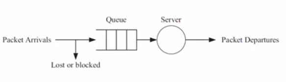

## 1. Examples of Queueing Theory 1

- Examples of the use of queueing theory in networking

    - Determining the number of trunks in a central office in plain old telephone service (POTS)

    - Calculating end-to-end throughput in networks

- Other examples are:

    - Waiting to pay in the supermarket

    - Waiting to pay in the tollgate

    - Waiting at the telephone for information

- We may have the following questions:

    - What is the average waiting time of a customer?

    - How many customers are waiting on average

    - How long is the average service time

## 2. Examples of Queueing Theory

    - Queueing theory tries to answer questions like e.g. the mean waiting time in the queue, the mean system response time (waiting time in the queue plus service times), mean utilization of the service facility, distribution of the number of customers in the queue, distribution of the number of customers in teh system and so forth.

    - A simplified queueing model for a delay/loss system.

