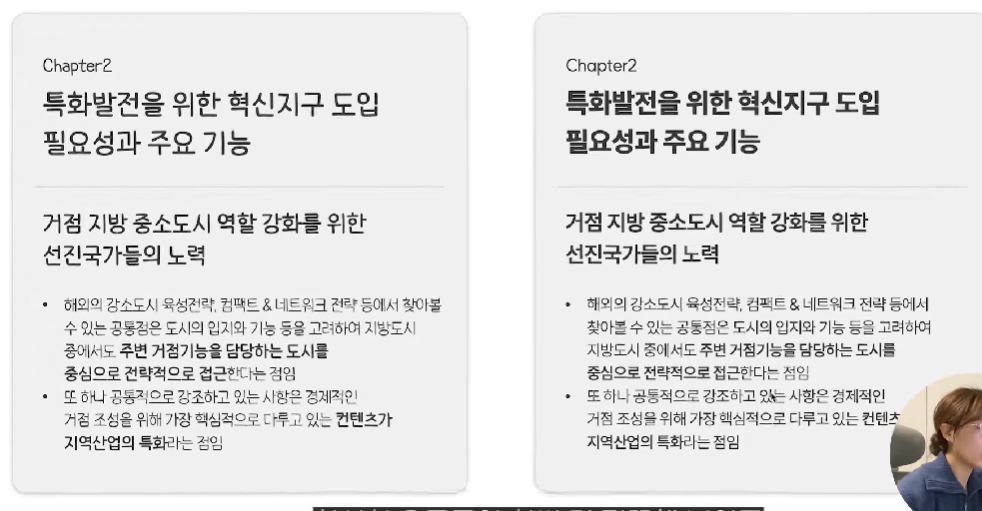

## 1. 다양한 굵기의 고딕체 활용

**[추천 고딕체]**
- 수트
다운로드: https://sun.fo/suit/
- 프리텐다드
다운로드: https://cactus.tistory.com/306
- 에스코어드림
다운로드: https://s-core.co.kr/company/font2/
- 나눔스퀘어 네오
다운로드: https://hangeul.naver.com/font/nanum
- 페이북
다운로드: https://paybooc.co.kr/app/paybooc/RPa...

## 2. 메인 컬러는 2가지 이하

**[영상 속 사이트]**

- Pigment (두 가지 색 조합 추천 사이트)
링크: https://pigment.shapefactory.co/
- ColorSpace (지정 색과 어울리는 색 추천 사이트)
링크: https://mycolor.space/

- 포인트 컬러에 무채색은 포함하지 말 것 

## 3. 도형 활용하기

- 기본 도형만 활용 

## 4. 아이콘 활용하기
- FLATICON (아이콘 사이트)
링크: https://www.flaticon.com/

## 5. 고화질 이미지 활용
- Pixabay (고화질 이미지 사이트)
링크: https://pixabay.com/ko/
- Unsplash (고화질 이미지 사이트)
링크: https://unsplash.com/ko
- FREEPIK
링크: https://www.freepik.com/