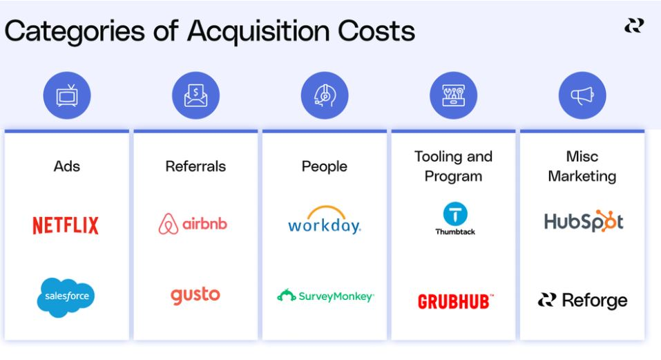

# 제품 가격 책정 방법 : 5 단계 프라이싱 전략 + 예시

여러분의 프라이싱 전략은 제품을 만들거나 망칠 수 있습니다. 만약 여러분이 잠재 고객과 기존 고객이 여러분의 핵심 서비스 또는 기능이 담긴 제품과 가격에 대해 가치를 가장 높게 느끼는 올바른 방향으로 가고 있는 겁니다. 그러나 프라이싱 전략을 결정할 때 고객 관점을 놓치기 쉽습니다.

### 패키징 & 프라이싱

제품 팀이 저지르는 몇 가지 일반적인 실수는 다음과 같습니다:

- 고객 중심의 전략을 세우는데 비해 어떤 기능을 어떻게 가격을 매길지에 지나치게 신경을 씁니다. 팀에서 가장 권력을 많이 가진 사람이 "좋은 거 같다"라는 말을 하는 것으로 진행합니다. 

- 시장에 맞게 의사결정하기보다는 경쟁자에 마주처 의사결정을 합니다. 경쟁자에 영향을 받아 제품의 뉘앙스와 돈을 버는데 드는데 드는 비용과 같은 실질적인 이슈를 무시합니다.

- (전략적 고민보다는) 외부 요인이나 경제적인 상황에 반응하여 프라이싱 전략을 결정합니다.

- 프라이싱 실수에 대응하는 시간이 너무 오래 걸립니다. 고객의 신뢰를 영원히 읽고 싶지 않다면, 신속하게 고객 관점에서 의사결정을 재평가하는 것이 필요합니다. 

궁극적으로 체계적인 방법으로 프라이싱 전략을 수립하거나 업데이트하지 못하고 충동적으로 행동한다면 최적의 가격 지점을 파악하지 못할 가능성이 높습니다. 여기서는 성장과 확장을 고려해서 지속 가능한 프라이싱 전략을 수립하는 5가지 단계를 살펴보겠습니다.

## 제품 가격 책정의 5단계

강력한 프라이싱 전략을 만들기 위한 5단계는 다음과 같습니다.

1. 제품의 가장 가치있는 속성인 가치 지표를 이용하여 가격을 조정하는 방법을 정의하십시오
2. 제품에 대한 고객의 지불 의향을 평가하십시오.
3. 프라이싱과 패키징 전략이 성장과 수익을 이끌고 있는지 확인하십시오.
4. 얼마나 매출을 올리고 있는지, 매출을 올리는데 얼마의 비용이 드는지 계산하십시오.
5. 필요에 따라 프라이싱 및 패키징 전략을 테스트하고 조정하십시오.

프라이싱 전략 가이드의 1단계에서는 가치 지표를 통해 가격을 조정하는 방법을 정의한다는 것이 무슨 의미인지 살펴보는 것으로 시작하겠습니다.

### <b>프라이싱 전략 1단계 : 가치 지표에 따라 가격을 결정하라</b>

제품의 가격을 결정할 때 가장 먼저 해야할 일은 고객이 가치를 느끼는 것을 전략의 중심으로 두는 것입니다. 고객이 제품에서 가장 중요하게 여기는 것이 무엇인지 파악하고 이를 전체 프라이싱 전략을 형성하는 핵심 요소로 활용합니다.

제품의 가장 가치 있는 단일 구성 요소를 가치 지표이라고 합니다. 그리고 가치 지표를 사용자당 혹은 단위당  청구하는 것으로 정의합니다.

고객이 제품에서 가장 중요하게 여기는 것이 무엇인지, 그리고 제품이 어떤 특별한 속성을 가지고 있는지를 고려할 때, 우리는 제품을 패키징하는 방법에 대해 동시에 생각해야 합니다.

이러한 방식으로 고객이 관심을 갖는 것과 고객이 가장 가치 있는 것에 대해 어떻게 지불해야 하는지에 대해 생각하기 시작합니다. 

제품을 패키징하는데는 세 가지 방법이 있습니다:

- 기능에 따른 패키징 : 제품의 기능이 차별화되면 사용자가 많아지고 기능이 많아짐에 따라 가격을 조정합니다.

- 사용 가치 지표에 따른 패키징 : 사용자가 제품을 더 많이 사용할수록 가격을 조정합니다. 

- 결과 지표에 따른 패키징 : 제품 사용의 결과가 사용자에게 미치는 영향에 따라 가격을 조정합니다.

이제 우리는 가치 지표, 즉 고객이 가장 중요하게 여기는 속성을 프라이싱 전략의 핵심으로 사용한다는 게 무슨 의미인지 알게 되었습니다.

우리는 또한 우리 제품을 패키징하는 세 가지 방법이 있다는 걸 알게 되었습니다. 그럼 다음 단계로 넘어가겠습니다.

### <b>프라이싱 전략 2단계 :고객의 지불 의사를 평가하라</b>

사용자가 가장 중요하게 생각하는 것이 무엇인지, 프라이싱 전략에서 이를 어떻게 패키징할지 결정한 후, 다음의 중요한 질문에 답하고 싶을 것입니다. 

고객이 비용을 지불할 의향이 있습니까?

이때부터 제품이 고객에게 가치를 제공하는 방식에 대한 고객의 관점이 가치지표를  기준으로 정의한 것과 유사한지, 고객이 지갑을 꺼낼 준비가 되었는지를 이해하기 시작합니다.

소비자의 지불 의향이 청구 가격보다 높을 때, 그들은 좋은 거래를 하고 있다고 느낍니다. 지불 의향이 청구 가격보다 낮으면 제품을 구매할 가능성이 급격히 줄어듭니다. 가치가 없는 것에 돈을 지불하고 있다는 생각을 하고 싶어하는 사람은 아무도 없습니다.

특정 상품이나 서비스에 대해 고객이 얼마를 지불할 용의가 있는지 보여주기 위해 고안된 Van Westendorp 설문조사 모델을 실행하여 지불 의향을 조사할 수 있습니다.

이러한 설문 조사는 가격 조사에 사용되어 특정 기간 동안 청구할 항목에 대한 결정을 내리는 데 도움이 됩니다. Van Westendorp 설문 조사 결과는 각 고객 세그먼트에 대한 가격대와 권장 가격대를 제공합니다.

제품에 대한 지불 의사에 영향을 미치는 세 가지 요소가 있습니다.

첫 번째는 사용 사례 또는 특정 사용자 페르소나가 처음부터 제품을 찾는 이유입니다. 예를 들어, 시스템에 맬웨어가 있는 잠재 고객의 사용 사례는 이를 제거하기 위해 많은 돈을 기꺼이 지불할 것입니다. 반면, 예방책으로 악성코드 방지 솔루션 구매를 고려하는 사람의 활용 사례는 더 많은 연구를 해야 할 입장에 있습니다. 이제 여러분은 사용사례가 어떤 게 있는지, 그리고 대안 제품이 아닌 여러분의 제품에 대해 비용을 지불하도록 선택해야 하는 이유를 고려하고 싶을 겁니다.

지불 의향에 영향을 미치는 두 번째 요인은 고객의 인구 통계학적 또는 기업 통계학적 상황입니다. 간단히 말해서, 고객의 유형에 따라 요구 사항이 다르고, 고객이 어디에 살고 있는지, 상황이 어떤지에 따라 달라집니다.

지불 의향에 영향을 미치는 세 번째 요인은 잠재 고객이 제품을 얼마나 자주 또는 얼마나 많이 사용하느냐입니다. 이러한 상황은 바뀔 수 있으며, 이는 당연히 지불 의향에 영향을 미칠 것입니다.

Van Westendorp 설문조사는 잠재 고객이 지불할 금액과 지불하지 않을 금액을 나타내는 훌륭한 지표이지만 여러분이 청구해야 하는 정확한 가격을 현실적으로 반영할 수도 있고 그렇지 않을 수도 있다는 점에 유의해야 합니다.

설문 조사에서 제시한 결과가 조직에 비즈니스적으로 적합한지 여부를 파악하기 위해 질적, 양적 연구를 수행해야 합니다. 

다음 단계로 넘어가겠습니다.

### <b>프라이싱 전략 3단계 : 프라이싱 전략이 성장을 주도하는지 확인하라</b>

이 시점에서 우리는 우리의 수익화 전략이 우리가 그로스 루프라고 부르는 것으로 고객의 여정을 시각화함으로써 매출을 만들어낼 수 있는지 살펴볼 수 있습니다. 프라이싱 전략이 올바른 방향으로 향하고 있는지 확인하기 위해 잠시 멈춰서서 고객 여정을 살펴보는 것은 매우 중요합니다.

마찰이 증가하면 신규 고객 확보 및 기존 고객 유지가 느려지거나 방해를 받을 수 있습니다. 즉, 그로스 루프에 마찰이 너무 많으면 매출에 영향을 미칩니다.

우리는 그로스 루프를 입력과 출력의 닫힌 시스템으로 정의합니다. 신규 및 재방문 고객은 루프를 통해 이동하며 출력을 생성하는 일련의 단계를 거칩니다. 이 산출물은 원래 투입물로 직접 재투자될 수 있으며, 이는 그로스 루프를 생성합니다.

<b> 프라이싱 전략 예시 : 줌 </b>

줌을 예로 들어 이 프로세스를 설명하겠습니다. 먼저 사용자가 회의를 열기 위해 플랫폼으로 들어옵니다. 그런 다음 친구나 동료를 초대합니다. 초대를 받은 게스트는 새 사용자로 등록하고 회의에 참석합니다. 제품의 가치를 살펴본 뒤 참석자 중 일부는 직접 호스트가 됩니다. 마지막으로 새 호스트는 다른 게스트 그룹을 회의에 초대하여 루프를 지속시킵니다.

이제 줌에 무료 플랜이 없다고 상상해 보십시오. 즉, 고객이 자신의 계정을 만들려면 비용을 지불해야 합니다. 이것은 네 번째 단계와 초대된 참석자가 자신의 회의 호스트가 되도록 유도되는 첫 번째 단계의 순환과정에 마찰을 일으킬 것입니다.

줌의 가격모델을 선불지급모델로 한다면, 이 모델은 새 호스트로 전환되는 참석자 수를 줄일 수 있습니다. 따라서 호스트에 의해 열리는 회의 수도 감소하여 제품 노출이 적어지고 신규고객도 감소할 것입니다. 

대신 줌의 무료 플랜은 그로스 루프에서 마찰을 제거하고 바이럴 획득을 가능하게 하고 리텐션 채널을 활성화합니다.

전환율이 높을수록 마찰이 적은 반면 전환을 못하게 막는 장애물은 성장에 심각한 악영향을 줄 수 있습니다. 수익화 모델, 즉 포괄적인 프라이싱 및 패키징 전략이 성장에 복합적으로 적합한지 확인해야 합니다. 

고객 여정에 따라 프라이싱 전략을 수립하여 경쟁이 아닌 성장을 주도하고 있음을 확인한 후에는 매출 대비 비용에 촛점을 두어야 합니다.

### <b>프라이싱 전략 4단계 : 매출 대비 비용을 고려하라</b>

프라이싱 전략과 제품 가격을 설정할 때 다음으로 고려해야 할 사항은 해당 매출을 만들어내는데 드는 비용입니다. 새로운 고객을 확보하는 데 드는 비용과 신뢰성있는 제품을 제공하는데 드는 비용을 고려해야 합니다. 이를 매출 대비 비용이라고 합니다.

매출을 만들기 위해 드는 비용은 고객 획득 비용과 고객 서비스 비용 두 가지 유형이 있습니다. 

<b>고객 획득 비용 </b>

이 비용에는 일반적으로 광고 비용, 판매 비용, 소개 비용 및 마케팅 팀 비용이 포함됩니다. 

<b>고객 서비스 비용</b>

이 비용에는 제품 개발, 스토리지, 고객 지원 및 물류 비용이 포함됩니다.

여러분이 세운 수익화 모델이 회사의 매출 성장을 만들어내려면 순매출이 매출 대비 비용보다 많은지 확인해야 합니다.

매출에서 고객 서비스 비용을 빼면 순공헌이익이 생깁니다. 즉, 순공헌이익은 고객을 확보함으로써 발생하는 매출에서 해당 고객에게 서비스를 제공하는 비용을 뺀 금액입니다. 조직은 순공헌이익을 사용하여 신제품 개발에 재투자하거나 새로운 고객을 확보할 수 있습니다.

또한 기업들은 고객에게 투자한 돈을 얼마나 빨리 자주 돌려받을지 고려해야 합니다. 이를 투자 회수 기간이라고 합니다. 투자 회수 기간을 통해 기업은 비즈니스를 지속적으로 성장시키기 위해 무엇을 확보할 수 있는지 파악할 수 있습니다.

투자 회수 기간은 고객 획득 및 서비스 비용을 정당화하기 위해 고객을 유지해야 하는 최소 시간입니다.

예를 들어, 투자 회수 기간이 6개월로 짧다면, 고객을 유지한 후 처음 6개월 동안의 수익은 모두 이익입니다.

그러나 투자 회수 기간이 3년 이상으로 매우 긴 경우, 이를 실현 가능한 프라이싱 전략으로 만들기 위해서는 고객을 오래 유지해야 합니다. 만약 여러분의 제품이 그렇게 할 수 있을지 확신하지 못한다면, 여러분은 수익성 있는 사업을 하는 데 어려움을 겪을 것입니다.

제품의 가격을 결정하는 5단계 프로세스의 마지막 단계는 테스트하고 필요에 따라 조정하는 것입니다. 넘어가시죠.

### <b>프라이싱 전략 5단계 : 프라이싱 전략을 테스트하고 조정하라</b>

가격을 올바르게 책정하기 위한 정성적이고 양적인 연구에도 불구하고, 그리고 고객을 확보하고 유지하기 위한 최선의 노력에도 불구하고, 프라이싱 전략의 효과는 완벽하게 예측할 수 없습니다.

따라서 A/B 테스트를 통해 가설을 테스트하는 것이 중요합니다. A/B테스트는 현재 제품 또는 대조군을 실험군과 비교하여 어떤 것이 나은지 확인합니다. 

테스트할 가설을 만들기 전에 범위를 정의하는 데 도움이 되는 다음 세 가지 질문에 답을 하십시오.

- 우리가 테스트하고 있는 변경 사항은 무엇입니까?
- 테스트가 어떤 지표를 움직일 것이라고 생각합니까? 다른 지표가 영향을 받습니까?
- 지표는 어느 방향으로 얼마나 움직일까요?

가격은 매우 민감한 주제이기 때문에 목표와 범위를 정의할 때 몇 가지 문제가 있습니다. 다른 소규모 A/B테스트와 달리 새로운 프라이싱 전략을 테스트할 때 사업의 다른 부분에서 예상치 못한 영향이 발생할 수 있습니다. 

- 첫째, 수익 창출 결정과 관련된 트레이드 오프가 있는데, 이는 단일 지표로는 포착할 수 없습니다.

- 둘째, 다른 성장 지표나 성장 루프에 미치는 영향을 측정하지 않습니다.

- 셋째, 이런 지표에 대한 장기적인 영향은 추적되지 않습니다.

가격 변경이 비즈니스 전체에 어떤 영향을 미치는지 정확하게 테스트하려면 명확한 가설과 범위에서 시작하는 것이 중요합니다. 테스트 범위를 정의할 때는 주요 성공 지표만 보지 말고 더 다양한 걸 확인하십시오. 추가 결과 지표, 트레이드오프 지표, 보조 성공 지표 및 선행 지표를 확인하십시오. 이 모든 데이터는 새로운 프라이싱 전략을 결정할 때 팀이 가장 좋은 정보에 입각한 결정을 내리는 데 도움이 될 것입니다.

프라이싱 전략 수정은 가장 민감한 성장 이니셔티브 중 하나이므로 서둘러서는 안 됩니다. 이해되지 않는 가격 변경으로 신뢰를 잃은 고객의 마음을 되돌리는 것은 매우 어렵습니다. 사람들을 가능한 한 투명하게 참여시키면 고객이 회사가 결정을 내리는 이유를 이해하도록 하는 데 큰 도움이 될 수 있습니다.

### <b>프라이싱 전략과 수익화 심층 탐구</b>

지금까지 새로운 프라이싱 전략을 구현하고 제품 가격을 책정하는 방법에 대한 개괄적인 내용을 살펴봤습니다. 제품 가격을 결정할 때는 다음 단계를 수행하십시오:

1단계: 제품의 가장 중요한 속성인 가치 지표 사용하여 가격을 조정하는 방법을 정의합니다.

2단계: 제품에 대한 고객의 지불 의향을 평가합니다.

3단계: 프라이싱 및 패키징 전략이 성장과 매출을 이끌어내는지 확인하십시오.

4단계: 매출을 만드는데 드는 비용을 계산합니다.

5단계: 필요에 따라 프라이싱 및 패키징 전략을 테스트하고 조정합니다.

단순하지만 (중요한) 진실은 제품이 어떻게 이익을 낼 것인지를 생각하는 것은 진지하게 (고민해야 하는) 일이라는 것입니다. 어떻게 진행되는지 확인하기 위해 무언가에 스티커를 붙이거나 경쟁사 분석만을 기준으로 가격 결정을 내릴 경우 여러분은 여러분 조직의 뉘앙스와 중요한 요소를 생각하지 못하는 것입니다.

프라이싱 전략과 성장은 밀접한 관련이 있습니다. 잠재 고객이 기꺼이 지불할 수 있는 가격이 서비스 비용과 구입 비용보다 낮다면 처음부터 다시 시작해야 합니다.

실무를 진행할 때 예측이 현실과 일치하는지 확인하기 위해 가격 테스트를 해보는 것이 매우 중요합니다.