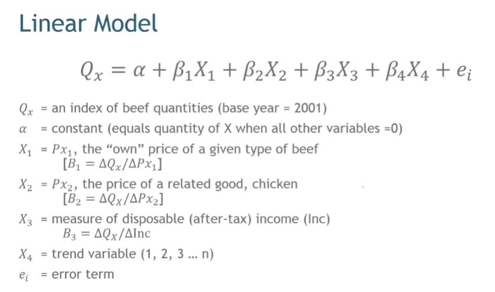
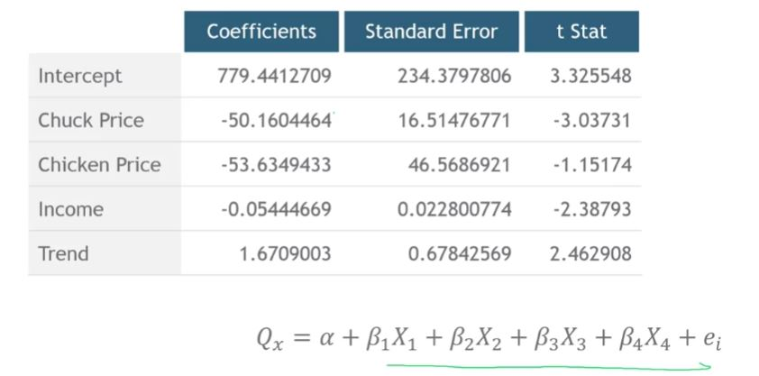

## 1. Why Measure Price Elasticity?

- Provides a standard way to predict quantity reactions to price
- Can enable us to better understand the competitive structure of the marketplace
- Price elasticity is defined as %dQ/%dP
    - The percent change in quantity divided by the percent change in change

- Cross-price elasticity is the percent change in my quantity divided by the change in some other price.

- Income elasticity is the percent change in quantity divded by the percent change in per capita disposable income.

## 2. Our Scanner Data

- Monthly sales and price data on different cuts of beef and chicken.
- Data is a national sample collected by the U.S Department of Agriculture (2001~2007).
- Also contains monthly data on per capita disposable income (Economagic)
    - Data and initial modeling information obtained from Hayes, Fred H. and Stephen A. DeLurgio, "Where's The Beef: Statistical Demand Estimation Using Supermarket Scanner Data," Journal of Case Research in Business and Economics.

## 3. Linear Model

- Initial analysis uses quantities and prices per pound for chuck roast
- Same for chicken.

## 4. What can we do with this?

- Calculate price elasticity, cross price elasticity and income elasticity
- Use the estimated model as a demand function.
- Compute the optimal price of this cut of beef under different scenarios.

## 5. Let's do that!

- Price elasticity is defined as %dQ/%dP
    - (dQ / Q) / (dP / P)
    - Rearranging : dQ/dP * P/Q
    - This is a nice formulation because you know dQ/dP
- So E = -50.16 * P/Q (use the means)
- E = -50.16 * 2.47 / 107.55 = -1.15
- A 10% change in price will be associated with an 11.5% change in quantity.