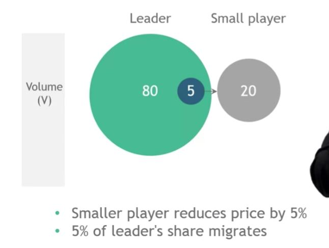
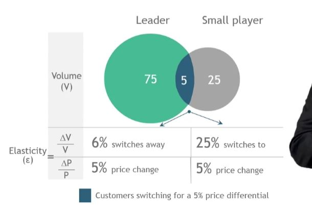

## 1. Market share is an effective predictor of price elasticity

## 2. Key takeaways

- Established, large players are less elastic
    - Tend to price at a premium
    - Select the price umbrella

- Small competitors have higher elasticities
    - Tend to undercut market leaders
    - Have opportunity to gain share

- Small channels tend to be more elastic
    - Online channel often has lower prices..