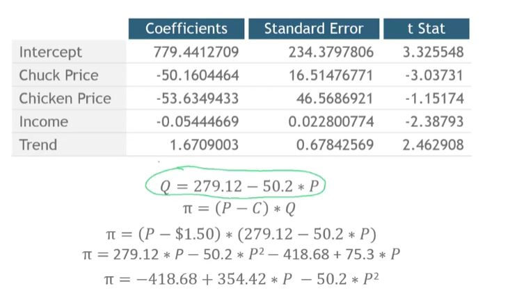

## 1. Price Optimization

- The scenario
    - You are the retailer
    - You are setting the price for month 56, which is the month that occurs next after the end of our data
    - You are going to price chicken at $1.75/pound
    - The wholesale price of chuck is $1.50/pound
    - Disposable income is stable around $10,000.

## 2. Building the Demand function

