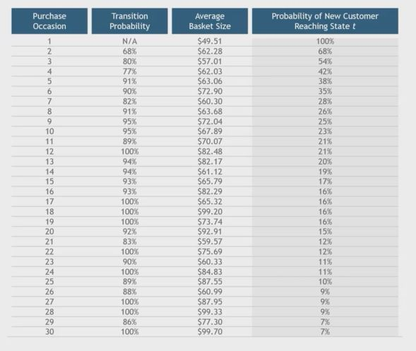

## 1. Where do you get these figures?

- Transition Probability

    - If you have 1,000 people in you database that made at least one purchase and 850 that made at least two, then the transition probability between purchase one and two is 85%

- Average Basket Size
    - Sefl evident from data

## 2. Early Segmentation is possible

- What you might know soon

    - Size of the first order
    - Early subsequent orders (On-line groceries)
    - Zip code (Economic Status)

## 3. Challenges with CLV

- You have to go far back into the data to get accurate purchase occasion probabilities

    - If not, data is censored and later-stage purchase probabilities are biased

- New customers may behave differently than old customers - and you're using historical data

## 4. CLV - Strategic Implications

- Provides a comprehensive forward looking measure of the customer relationship

- Can connect marketing strategies to financial consequences

- Allows us to determine the full financial impact of pricing decisions

- Allows for selecting for marketing communication and determining the level of resources to be allocated for each customer

- Strategic alternatives can be evaluated based on whether they improve customer satisfaction, retention, and lifetime value