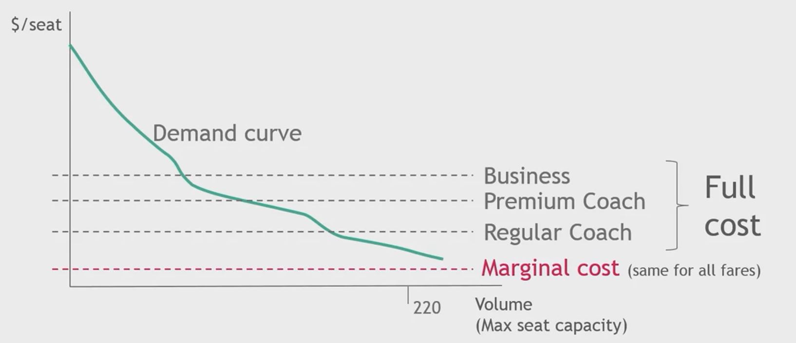
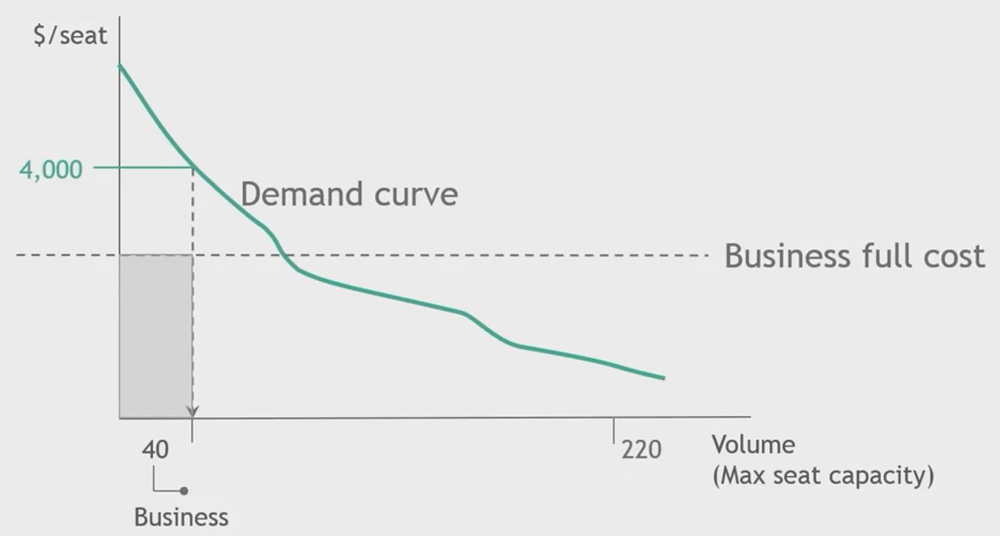
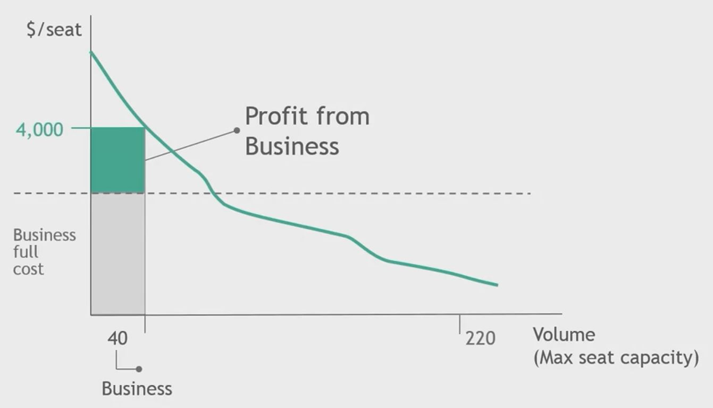
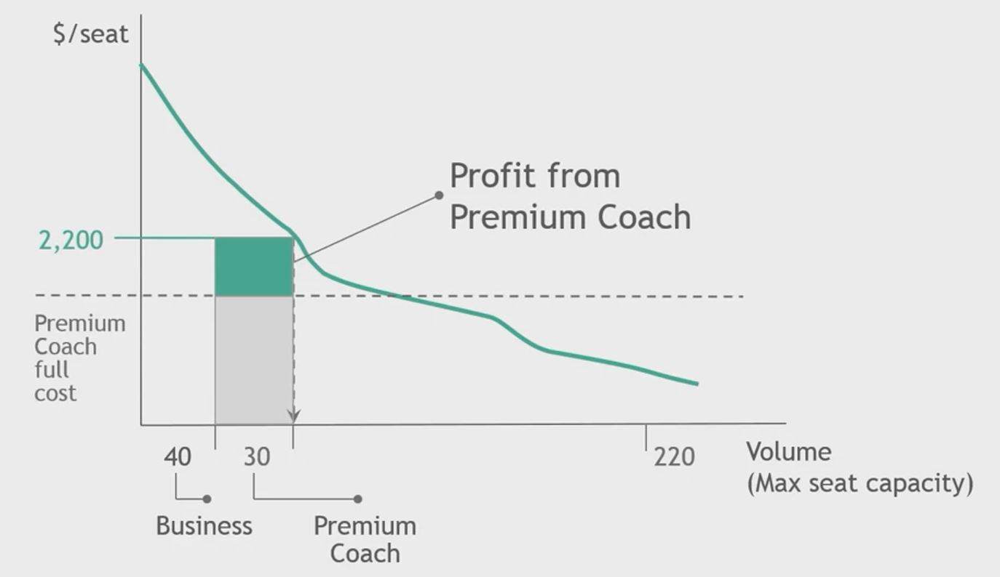
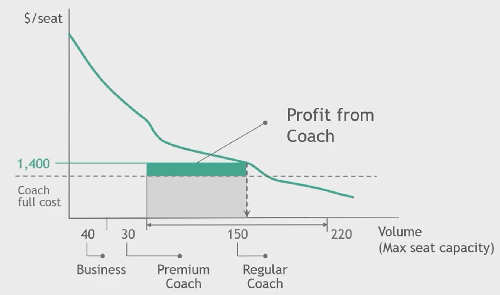
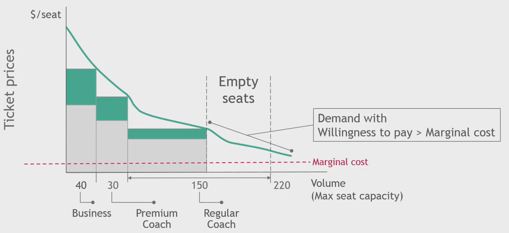
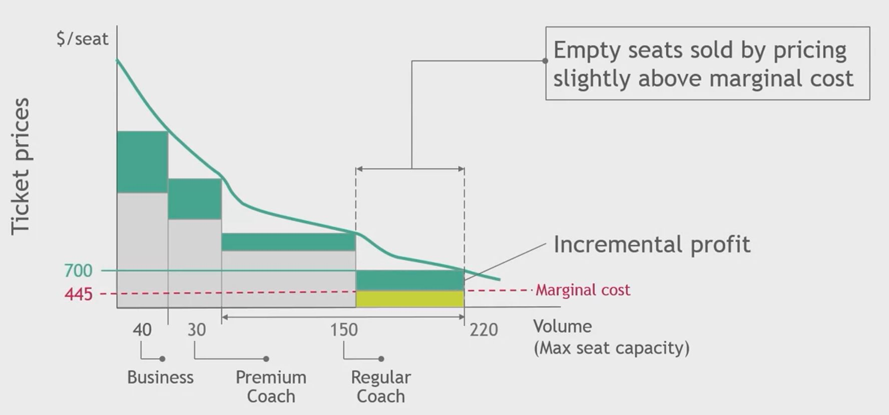

## 1. Marginal cost pricing example : airline industry

- Marginal cost for an incremental passenger

    - Airport service fees: facility, security, baggage handling
    - Transaction cost: reservation, check-in, boarding

    - Higher fuel consumption due to additionapl weight
    - Meals and drinks

## 2. Marginal cost pricing example: Flight JFK (New York) -> CDG (Paris)

## 3. Discussion of marginal cost pricing

- Advanges / disadvantages
    - Same as for cost-plus pricing at full cost

- Risk
    - Impacts willingness to pay and buying behaviors of regular paying customers

- Mitigation strategy
    - Differentiate offering at marginal cost to reflect lower price

## 4. Closing questions for you

- Does your business use marginal cost pricing?

- Do you fully understand your marginal cost?

- Is the incremental profit worth the risk of longer-term price erosion?

- How do you differentiate your offers to avoid price erosion?
