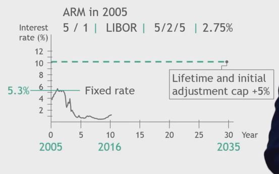

## 1. Index based pricing

- ... Method to adjusts price during the contract period
- ...in line with changes to cost

- Don't confuse with Price Index!

- A bit of a niche topic, but very important for some industries

## 2. Key features of contracts with index based pricing

- Selecting the right index
- Frequency of price adjustments
- Price caps
    
## 3. Example for index-based pricing

- Adjustable Rate Mortgage (ARM)

- How lenders quote ARMs
    - 5 / 1 LIBOR 5/2/5 2.25%

## 4. Example : Adjustable Rate Morgage

## 5. What does it make sense to use?

- Long term contracts

- Low margin business

- Cost structure dominated by few big cost items

- Cost is volatile
