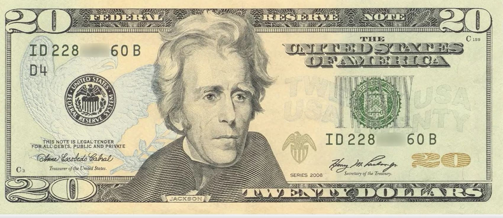

## 1. Why Auction Mechanism is Important?

It's important that we understand the different types of auctions, because there really are several different types.

## 2. Auctions and Bidding : A Primer

- Explore the origins and key characteristics of the five major auction types
- Look at when and how auctions are used in many different business settings.

## 3. Let's Start by Thinking about $20!

- How much would you be willing to pay me for this $20 bill?
