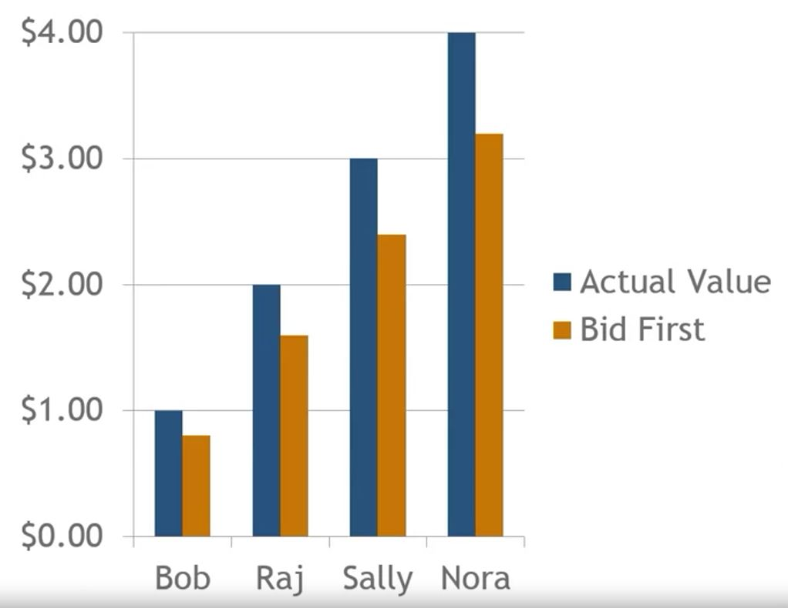
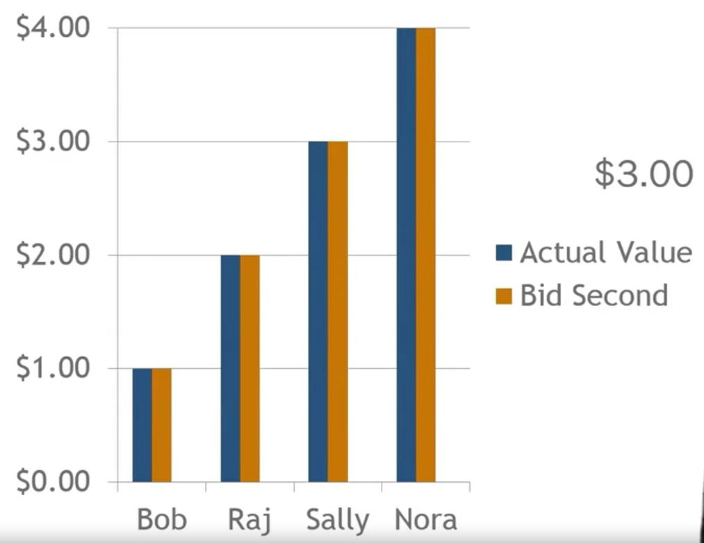
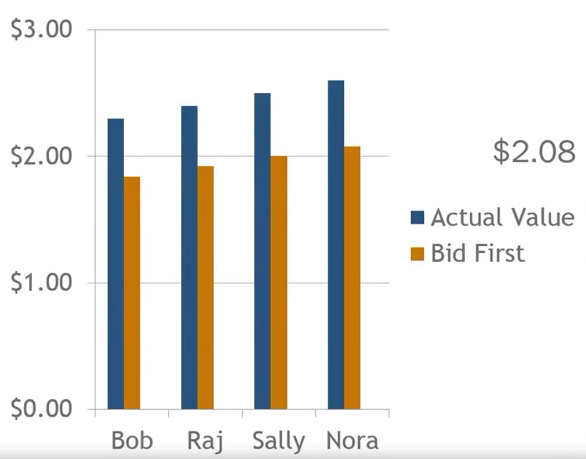
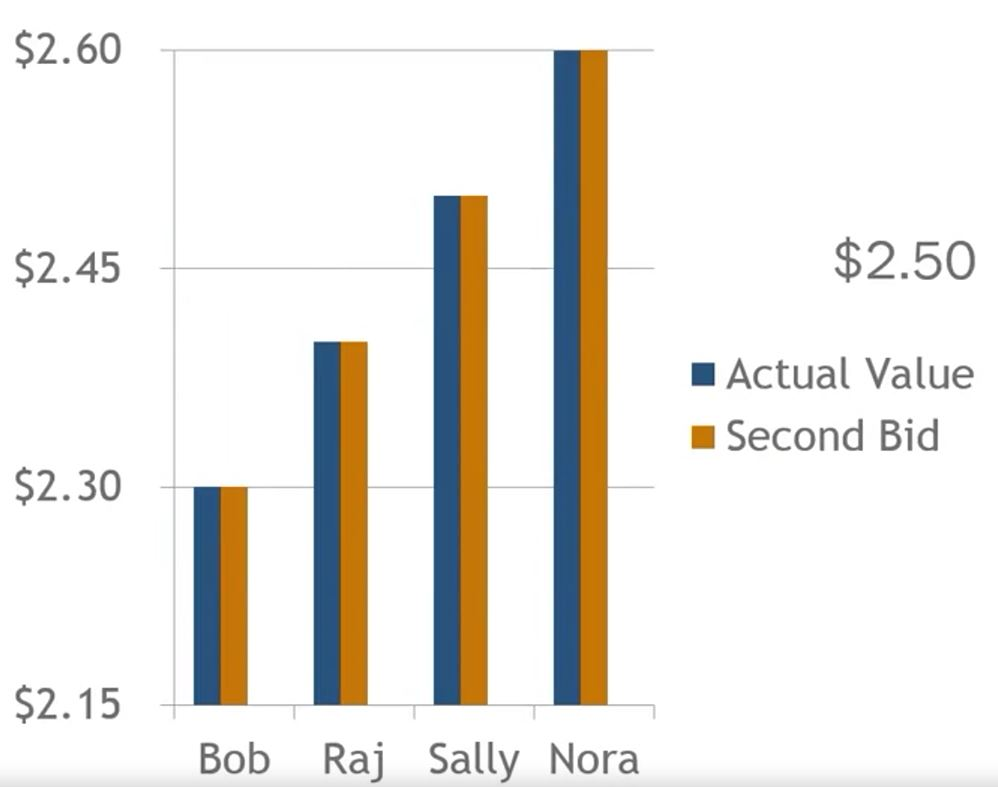

## 1. Sealed-bid Auctions

- Bidders submit their bids independently and are not privy to other bid values
- First-price wealed-bid auction
    - Highest bidder wins
- Second-price sealed-bid auction
    - AKA Vickrey auctions
    - Highest bidder wins at the price bid by the second-highest bidder

## 2. Case 1 - First Price Sealed Bid 

## 3. Case 1 - Second Price Sealed Bid 

## 4. Case 2 - First Price Sealed Bid

## 5. Case 2 - Second Price Sealed Bid

## 6. First Price vs Second Price

- First Price
    - Works well when there is a lot of variance in private values

- Second Price
    - Gets buyers to bid their actual valuation, instead of shading their bid downward
    - Works well when there is less variance