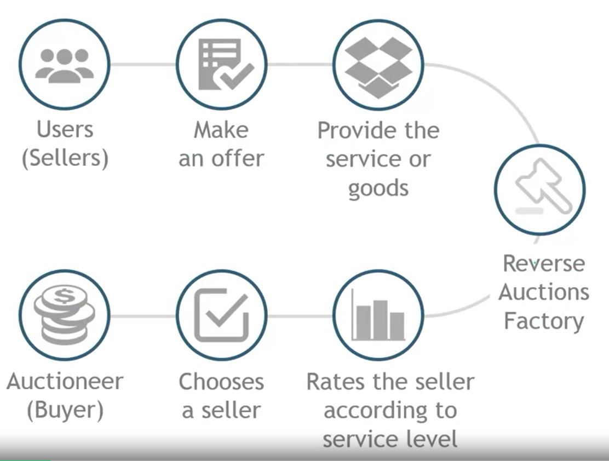
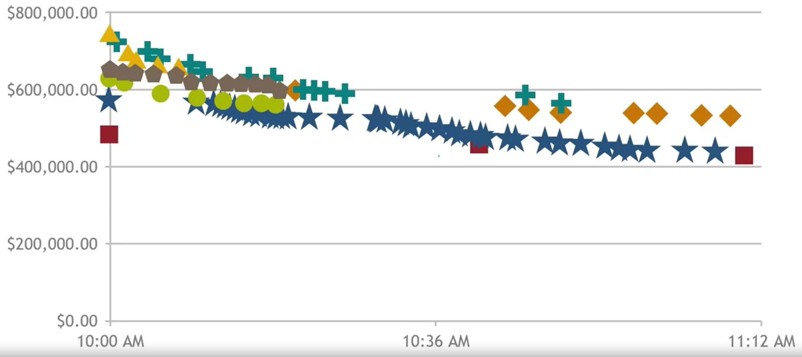

## 1. B2B Reverse Auctions

- Used by many businesses and governmental organizations
    - Reduces costs for the supply a particular product (i.e. stamped metal)
    - Requires careful specification of a supply contract and suppliers who are willing to bid for that contract
    - Used for items that are more-or-less commodities-or that have easily specified engineering characteristics

## 2. Disadvantages of B2B Reverse Auctions

- Focus on price can destroy trust in the supply relationship
- Supplier customer service may be sacrificed to achieve cost savings
- Can drive suppliers marginss so low that it threatens future supply