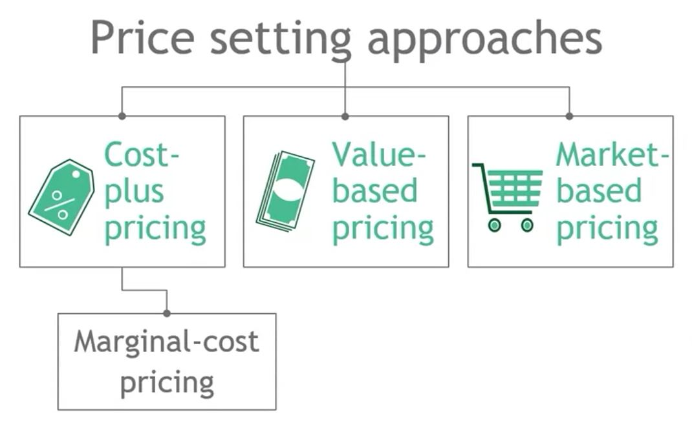
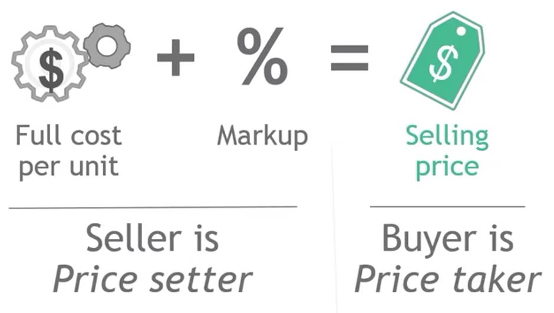
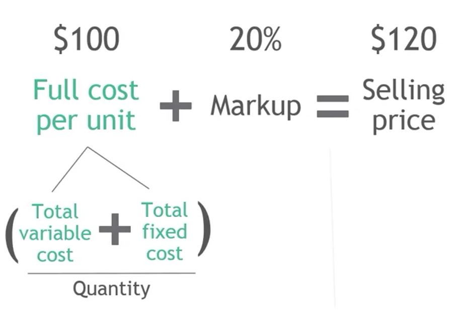
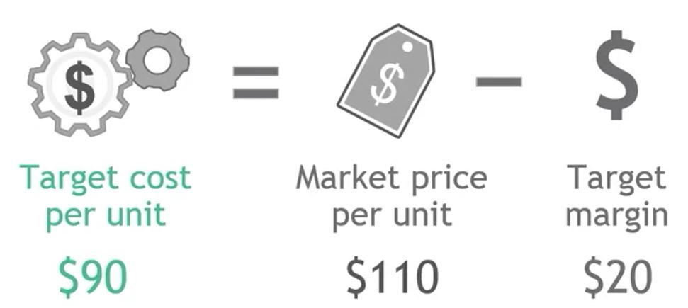
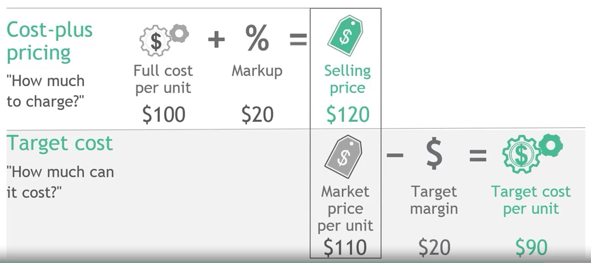
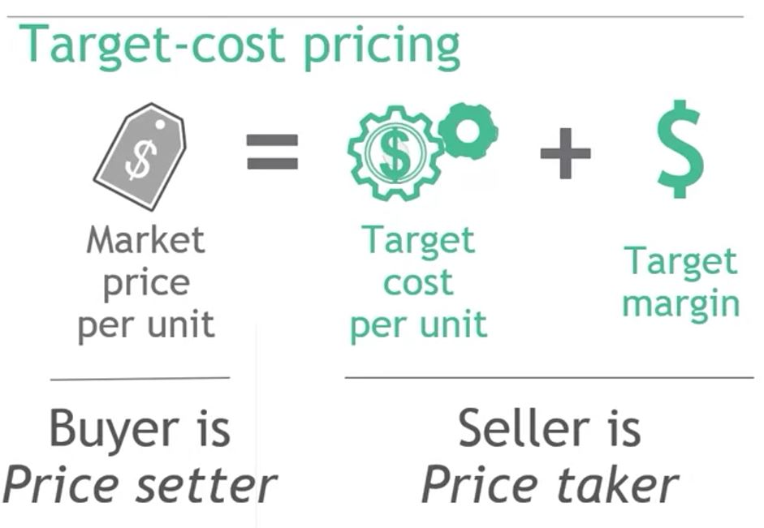

## 1. How does a business decide what to charge for its products?

## 2. Three main approaches to setting prices

## 3. Cost-plus pricing

## 4. Example calculation

## 5. When is cost-plus pricing useful?

1. Situations where sellers have sufficient pricing power

2. Transactions with very custom specifications and outcomes

3. Industries with regulated prices

4. Starting point to set the price for a new product

## 6. Advantages vs disadvantages of cost-plus pricing

1. Advantages

    - Simple to execute
    - Guarantees targeted margin
    - Intuitively understandable
    - Easy to defend

2. Disadvantages

    - Ususally leads to sub-optimal pricing
    - Promotes cost inefficiency
    - Ignores opportunity cost
    - Uses historical cost rather than current or future replacement value

## 7. Target-cost pricing

## 8. Cost-plus vs Target-cost pricing

## 9. With target-cost pricing, buyers set a product's price

