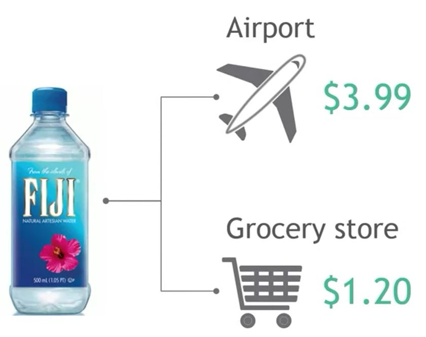
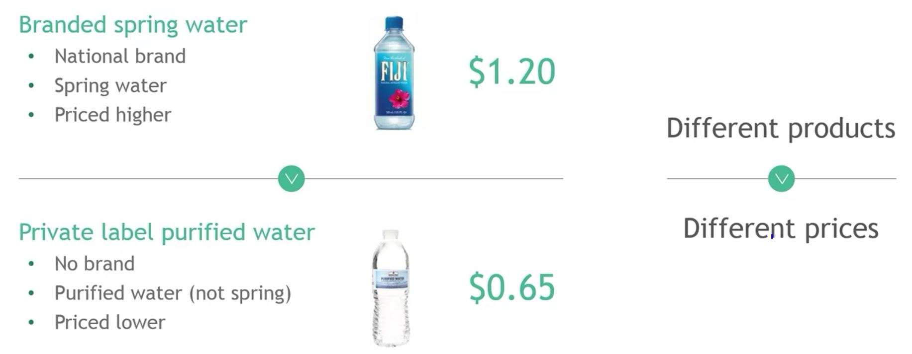
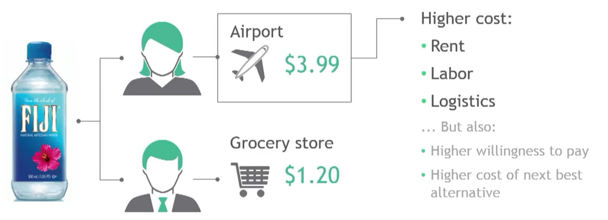

## 1. Why does the price vary for the exact same product by 3x?

## 2. Price discrimination

- Price discrimination describes the practice of selling an identical product to different buyers at different sales prices
- Synonyms
    - Price differentiation
    - Differential pricing

## 3. Price discrimination vs Product differentiation

## 4. Why do sellers discriminate when setting prices?

## 5. Why do buyers accept price discrimination?

- Higher prices
    - Prices can be less important than other factors, e.g. convenience

- Lower prices
    - Buyers can't afford to pay more and enjoy a 'good deal'

## 6. What is cost-based price discrimination?

- Cost of doing business often varies widely between different customers and transactions

## 7. Let's be honest

- Cost of doing business at an airport is certainly higher, but so much to justify a price of 3x more?

- ... probably not

- So what else is going on?

## 8. Cost-based price discrimination helps sellers to optimize margins

- Higher cost
    - Seller passes cost plus additional markup through to buyer

- Lower cost
    - Seller passes only part of cost saving through to buyer