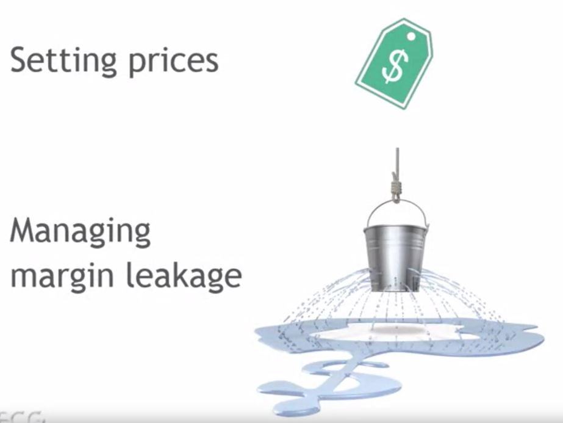
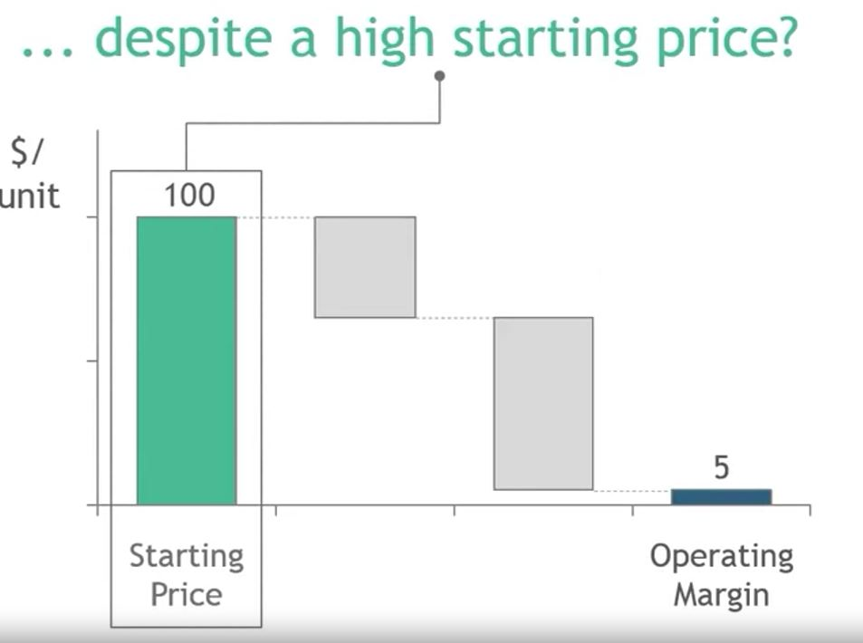
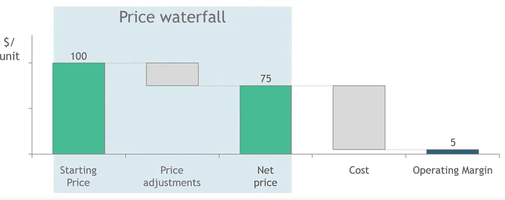
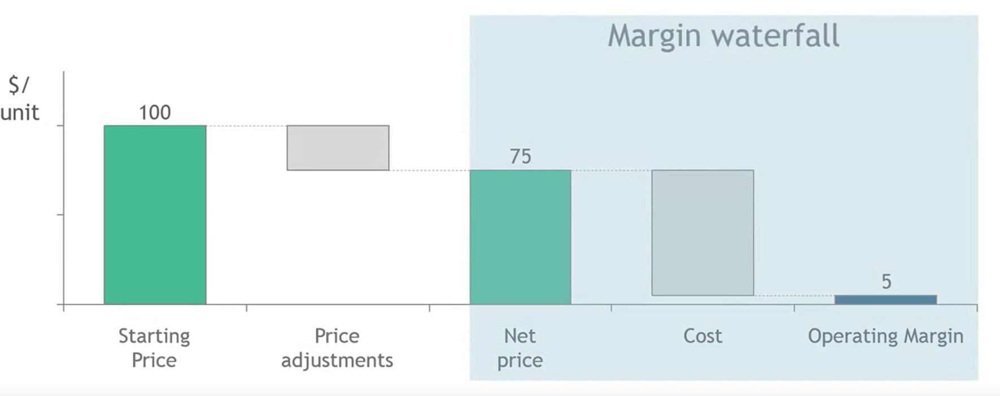
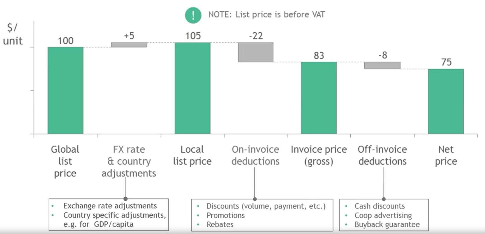
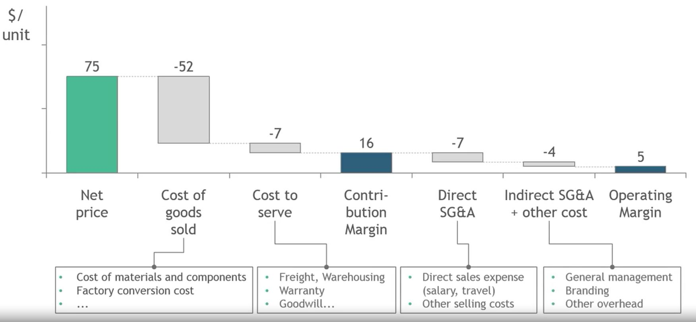

## 1. Pricing practitioners have to worry about two core issues

## 2. What's happening when products make hardly any money... 

## 3. Price and Margin waterfall is a great tool to discuss margin leakage

## 4. Price waterfall and its components

## 5. Margin waterfall and its components

## 6. Margin waterfall and fixed and variable cost

## 7. Closing thoughts

- Price and margin waterfall
    - illustrates relationship between price and margin
    - great tool to discuss your business with stakeholders

- Cost and margin buckets can be easily benchmarked to identify root causes of leakage.

- Often difficult to get the data. Do your best; it's important to determine probability.

- Select most useful dimensions when constructing waterfall charts
    - Unit of analysis: a SKU, product category or business segment
    - Dimension of Y-axis: $ per unit, absolute $ or % of Net Sales