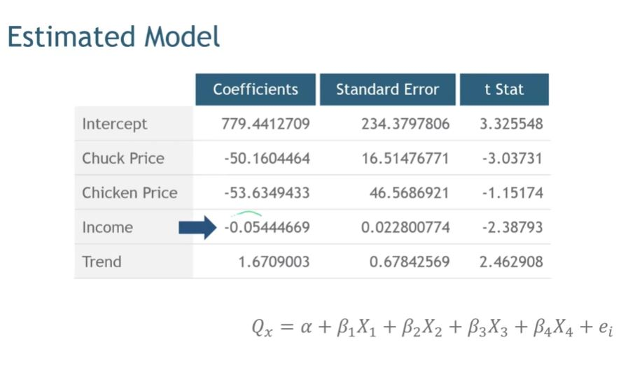
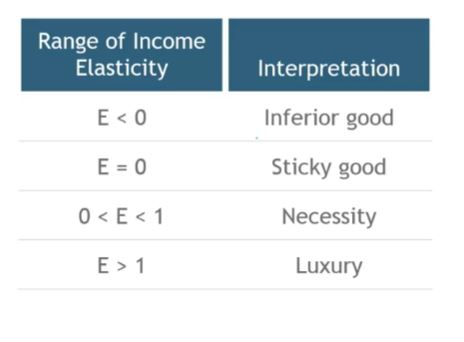

## 1. Income Elasticity

- Income elasticity is defined as %dQ/%dI
- E_I = dQ/dI * I/Q

- So E_i = -0.054 * I/Q
- E_i = -0.054 * 9252.85/107.55 = -4.646
- The negative sign indicates that this product is an inferior good.
- A 10% increase in disposable income will decrease our demand by about 46%

## 2. Interpreting Income Elasticity

