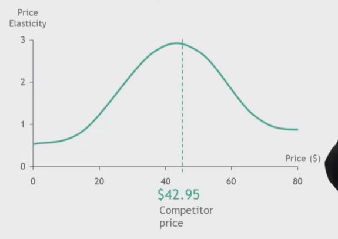
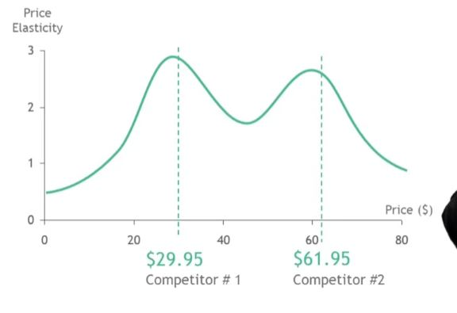
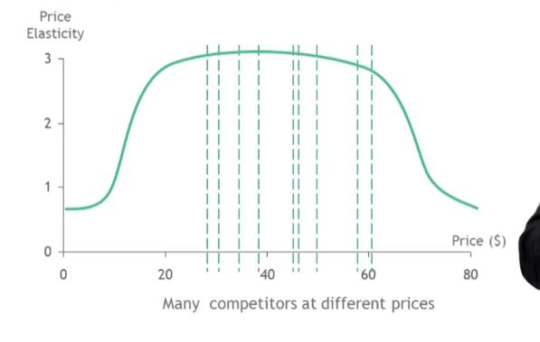

## 1. Elasticity is higher around competitors' prices

- Elasticity is highest at the price of your competitor, and pricing close to existing price points tends to be the best strategy with one competitor in the market.

- The Constant Elasticity Hypothesis explains that there is a plateau of elasticity between competitors where elasticity will be the same across. When there are multiple competitors in the market, you'll want to price somewhere in this range.