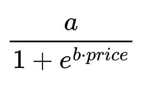
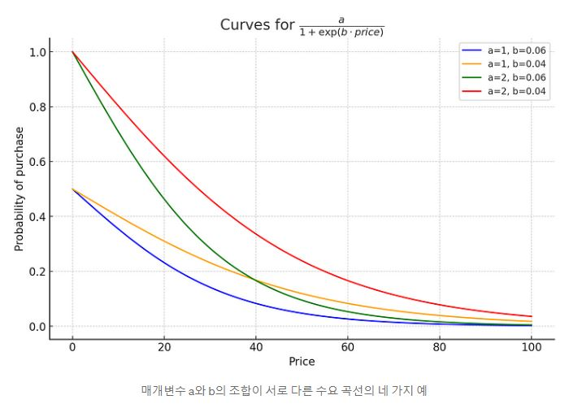
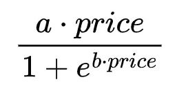
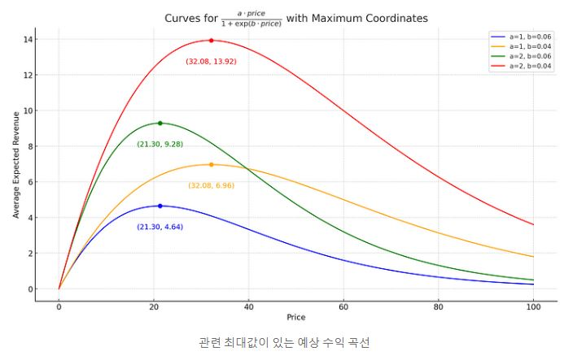
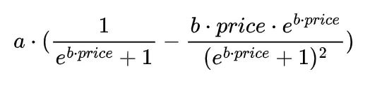

## 동적 가격 책정, 강화학습 및 Multi-Armed Bandit

광대한 의사 결정 문제의 세계에서 강화 학습 전략이 특히 소유하고 있는 한 가지 딜레마는 탐색(exploration) 대 이용(exploitation)입니다. 슬롯머신("외팔이 산적"이라고도 함)이 줄지어 있는 카지노에 들어가는 것을 상상해 보십시오. 슬롯머신마다 서로 다른 알 수 없는 보상을 지불합니다. 어떤 기계가 가장 높은 지불금을 가지고 있는지 알아보기 위해 각 기계를 탐색하고 플레이합니까, 아니면 잭팟이기를 바라며 한 기계에 집착합니까? 이 은유적 시나리오는 MAB(Multi-armed Bandit) 문제의 개념을 뒷받침합니다. 목표는 일련의 플레이를 통해 보상을 극대화하는 전략을 찾는 것입니다. 탐색은 새로운 통찰력을 제공하지만 이용은 이미 보유한 정보를 활용합니다.

이제 소매 시나리오에서 이 원칙을 동적 가격 책정으로 바꿉니다. 당신이 새로운 제품을 가지고 있는 전자 상거래 상점 주인이라고 가정해 보십시오. 최적의 판매 가격이 확실하지 않습니다. 수익을 극대화하는 가격을 어떻게 설정합니까? 고객의 지불 의향을 이해하기 위해 다른 가격을 탐색해야 합니까, 아니면 역사적으로 좋은 성과를 보인 가격을 이용해야 합니까? 동적 가격 책정은 본질적으로 변장한 MAB 문제입니다. 각 시간 단계에서 모든 후보 가격대는 슬롯 머신의 "팔"로 볼 수 있으며 해당 가격에서 생성된 수익은 "보상"입니다. 이를 확인하는 또 다른 방법은 동적 가격 책정의 목적이 고객 기반의 수요가 다양한 가격대에 어떻게 반응하는지 신속하고 정확하게 측정하는 것입니다. 간단히 말해서 목표는 고객 행동을 가장 잘 반영하는 수요 곡선을 정확히 찾아내는 것입니다.

이 글에서는 4가지 Multi-armed Bandit 알고리즘을 살펴보고 잘 정의된(직접적이지는 않지만) 수요 곡선에 대한 효율성을 평가합니다. 그런 다음 각 알고리즘의 기본 강점과 한계를 분석하고 성능을 측정하는 데 중요한 주요 지표를 탐구합니다.

## 수요 곡선 모델링

전통적으로 경제학의 수요 곡선은 제품 가격과 소비자가 구매하려는 제품 수량 간의 관계를 설명합니다. 그들은 일반적으로 아래쪽으로 기울어지며 가격이 상승하면 일반적으로 수요가 감소하고 그 반대도 마찬가지라는 일반적인 관찰을 나타냅니다. 스마트폰이나 콘서트 티켓과 같은 인기 상품을 떠올려 보세요. 가격을 낮추면 더 많은 사람들이 사는 경향이 있지만 가격이 급등하면 열렬한 팬도 두 번 생각할 수 있습니다.

그러나 우리의 맥락에서 우리는 수요 곡선을 약간 다르게 모델링할 것입니다. 우리는 확률에 대해 가격을 매기고 있습니다. 왜? 동적 가격 책정 시나리오, 특히 디지털 상품이나 서비스에서는 정확한 수량을 추측하는 것보다 주어진 가격에서 판매 가능성 측면에서 생각하는 것이 더 의미 있는 경우가 많습니다. 이러한 환경에서 각 가격 책정 시도는 주어진 테스트 가격에 따라 확률 p 가 있는 베르누이 확률 변수로 쉽게 모델링할 수 있는 성공(또는 구매) 가능성을 탐색하는 것으로 볼 수 있습니다.

여기가 특히 흥미로워지는 부분입니다. 직관적으로 우리 Multi-armed Bandit 알고리즘의 임무는 구매 확률이 가장 높은 이상적인 가격을 찾아내는 것이라고 생각할 수 있지만 그렇게 간단하지는 않습니다. 사실 우리의 궁극적인 목표는 수익(또는 마진)을 극대화하는 것입니다. 이것은 우리가 가장 많은 사람들이 '구매'를 클릭하게 만드는 가격을 찾는 것이 아니라 관련 구매 가능성을 곱했을 때 가장 높은 기대 수익을 제공하는 가격을 찾고 있다는 것을 의미합니다. 더 적은 수의 사람들이 구매하는 높은 가격을 책정한다고 상상해보십시오. 그러나 각 판매는 상당한 수익을 창출합니다. 반대로 매우 낮은 가격은 더 많은 구매자를 끌어들일 수 있지만 총 수익은 여전히 ​​높은 가격 시나리오보다 낮을 수 있습니다. 따라서 우리의 맥락에서 '수요 곡선'에 대해 이야기하는 것은 다소 파격적입니다.

이제 계산을 시작하겠습니다. 특히 가격 민감도를 다룰 때 소비자 행동이 항상 선형적이지는 않다는 점부터 시작하겠습니다. 선형 모델은 가격이 점진적으로 증가할 때마다 수요가 지속적으로 감소한다고 제안할 수 있습니다. 실제로 이 관계는 종종 더 복잡하고 비선형적입니다. 이 동작을 모델링하는 한 가지 방법은 이 미묘한 관계를 보다 효과적으로 캡처할 수 있는 물류 기능을 사용하는 것입니다. 수요 곡선에 대해 선택한 모델은 다음과 같습니다.





여기서 a는 달성 가능한 최대 구매 확률을 나타내고 b는 가격 변화에 대한 수요 곡선의 민감도를 조절합니다. b 값이 클수록 곡선이 가파르다는 것을 의미하며, 가격이 상승할수록 구매 확률이 낮아지기 위해 더 빠르게 접근합니다.



주어진 가격대에 대해 관련 구매 확률 p 를 얻을 수 있습니다 . 그런 다음 Bernoulli 랜덤 변수 생성기에 p를 입력하여 특정 가격 제안에 대한 고객의 반응을 시뮬레이션할 수 있습니다. 즉, 가격이 주어지면 보상 기능을 쉽게 모방할 수 있습니다.

다음으로 주어진 가격대에 대한 예상 수익을 얻기 위해 이 함수에 가격을 곱할 수 있습니다.



당연히 이 함수는 가장 높은 확률에 대응하여 최대값에 도달하지 않습니다. 또한 최대값과 관련된 가격은 매개변수 a 의 값에 의존하지 않지만 최대 기대 수익은 의존합니다.



미적분학에서 약간의 기억을 통해 미분에 대한 공식을 유도할 수도 있습니다(곱과 연쇄 법칙의 조합을 사용해야 합니다). 쉽진 않지만 그렇다고 너무 어렵지도 않습니다. 다음은 예상 수익의 미분에 대한 분석적 표현입니다.



이 식을 통해 예상 수익 곡선을 최대화하는 정확한 가격을 찾을 수 있습니다. 즉, 이 특정 공식을 일부 수치 알고리즘과 함께 사용하면 이를 0으로 설정하는 가격을 쉽게 결정할 수 있습니다. 이것은 다시 예상 수익을 최대화하는 가격입니다.

이것이 바로 우리가 필요로 하는 것입니다. 왜냐하면 a 와 b 의 값을 고정함으로써 모델이 찾아야 할 목표 가격을 즉시 알 수 있기 때문입니다. Python에서 이것을 코딩하는 것은 몇 줄의 코드 문제입니다.

```python
import numpy as np
from scipy.optimize import fsolve
from scipy.stats import bernoulli

def demand_curve(price, a=0.5, b=0.05):
    # demand curve modeled via logisti function
    return a / (1 + np.exp(b * price))

def revenue_derivative(x, a=0.5, b=0.05):
    # derivative of the function x*demand_curve
    return a / (np.exp(b * x) + 1) - (a * b * x * np.exp(b * x)) / (np.exp(b * x) + 1) ** 2

def get_optimal_price(a=0.5, b=0.05):
    # find the root of the revenue derivative
    return fsolve(revenue_derivative, 0, args=(a, b))[0]

def get_reward(price, a=0.5, b=0.05):
    # reward is 1 or 0 based on a Bernoulli distribution whose 'p' depends on the demand vurve
    prob = demand_curve(price, a, b)
    return bernoulli.rvs(prob)

```

사용 사례의 경우 a = 2 및 b = 0.042로 설정하면 최적 확률 0.436과 관련된 약 30.44의 목표 가격이 제공됩니다(→ 최적 평균 보상은 30.44*0.436=13.26). 이 가격은 일반적으로 알 수 없으며 Multi-armed Bandit 알고리즘이 추구하는 가격입니다.

## Multi-armed Bandit 전략


