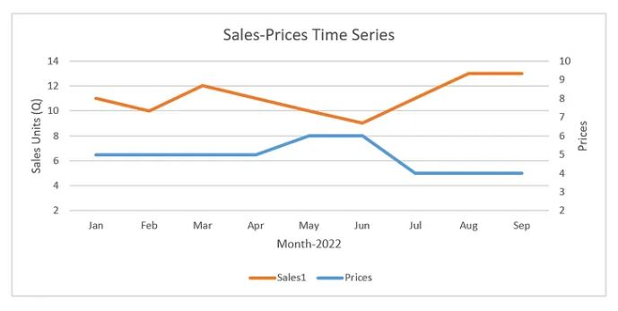
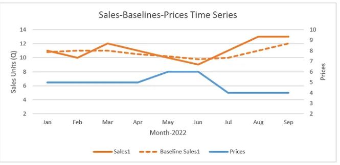

## 1. 개요

가격은 비즈니스 세계에서 매우 중요한 역할을 합니다. 매출과 마진 사이의 균형을 맞추는 것은 모든 비즈니스의 성공을 위해 매우 중요합니다. 데이터 과학 방식으로 어떻게 할 수 있을까요? 이 섹션에서는 가격 최적화를 위해 직관적으로 데이터 과학 솔루션을 만들어본 다음 각 구성 요소의 세부 정보와 코드를 살펴보겠습니다.

참고 — 다양한 유형의 가격 책정 전략이 있지만 이 글에서는 가격 변경 내역에 대한 충분한 데이터를 바탕으로 기존 비즈니스/기존 브랜드에 대한 가격 책정 전략을 구축하는 데 중점을 둘 것입니다. 세부 사항을 설명하기 전에 우리가 따르려고 하는 기본 접근 방식을 살펴보겠습니다.

품목 1에 대한 판매량 및 가격을 표시했습니다. 지난 9개월 동안 2번의 가격 변경이 있었으며 판매에 미치는 영향을 명확하게 확인할 수 있습니다. 가격이 낮을 때 판매량은 더 높았습니다. 이제 문제는 과거의 가격 변화가 매출에 미치는 영향을 어떻게 정량화하고, 향후 해당 품목의 최적 가격을 예측하는가입니다.

1~4월을 보면 흥미롭게도 가격이 5달러로 고정되었지만 매출 변동이 발생하는 것을 볼 수 있습니다. 실제 세계에는 계절성, 휴일, 판촉 행사, 마케팅 비용 등 매출에 영향을 미치는 외부 요인이 많기 때문에 이는 매우 정상적인 현상입니다. 이제 문제는 과거 가격 변화로 인한 매출에 미치는 영향을 어떻게 수치화하고 향후 해당 품목에 대한 최적 가격을 예측할 수 있느냐는 것입니다.

