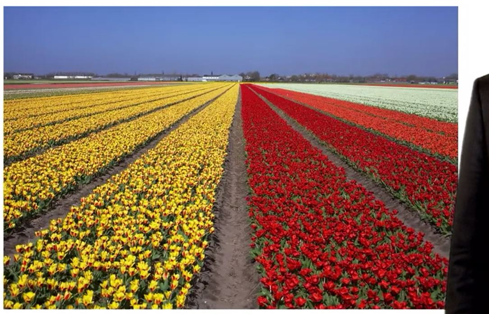
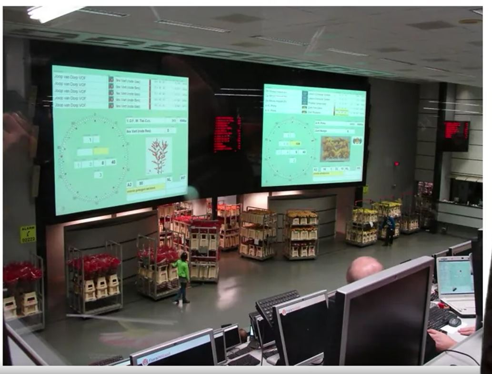

## 1. Dutch Auctions

- AKA descending-price auctions
- Bidding starts at a high price and drops until a bidder accepts the price
- Often better for the seller if buyers are risk averse to losing
- Fast!

## 2. Dutch Auctions : Origins

These were used for tulip value auctions a long time ago.

## 3. Dutch Auctions : Today

## 4. Dutch Auctions : They Happen Everywhere

- If you think about buying an automobile, it's true that when a new model comes out, the price is quite high and over the model year the price decline.

- And when you buy an automobile what you have to ask yourself is 'Do I want it right now?' or 'Am I willing to wait a while and maybe get a little bit better deal on it?'

- But if I wait a little while I am risking that particular color or style that I might want in that automobile.

- It's still there they might run out at some point.

- In that way, a Dutch auction acts a segmentation mechanism as well in the sense that it's segment buyers between those who have high valuation for the item and those who have low valuation.

- Those who have a high valuation are likely to jump on it right away and get that high price, and those who have a lower valuation are more likely to wait, hang back and get a better deal.

- So instead of charging a single price, you can charge potentially different prices to different buyers in these kind of real-world Dutch auction markets.

## 5. Dutch Auctions

- Predictable over-time price discounts
    - Clothing
    - Cars
    - Consumer electronics
    
