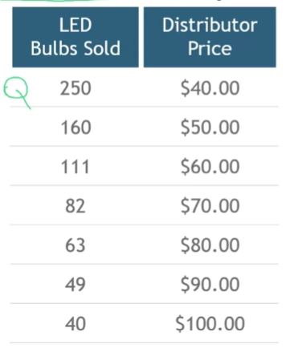
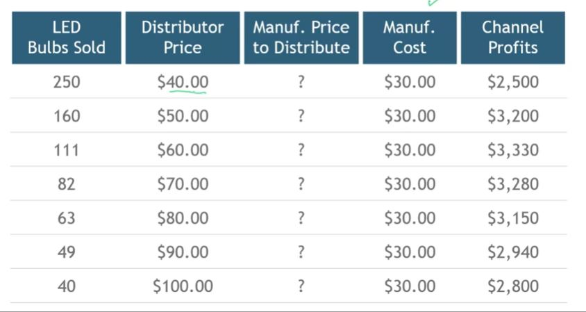
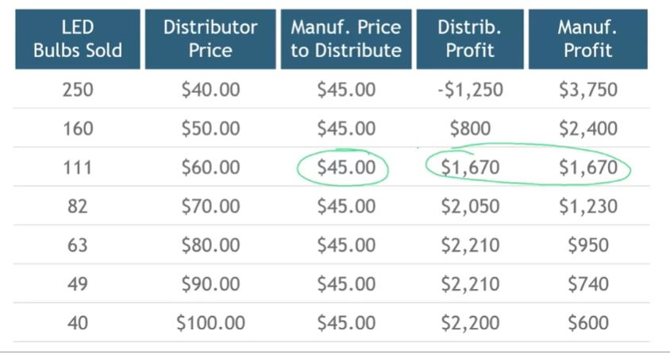
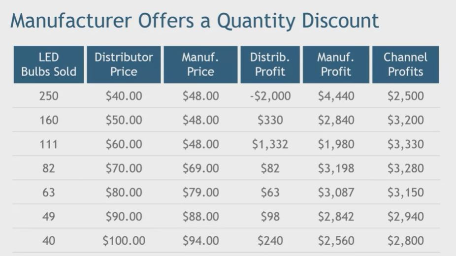

## 1. What is missing for the manufacturer's pricing decision?

## 2. Prices, Sales, and Profits

## 3. Manufacturer Charges $45

## 4. Manufacturer Offers a Quantity Discount

## 5. Dangers of Volume Discounts

- Forward buying, diverting
- Larger, more powerful customers take advantage of small customers
- Accounting confusion about costs, margins, prices