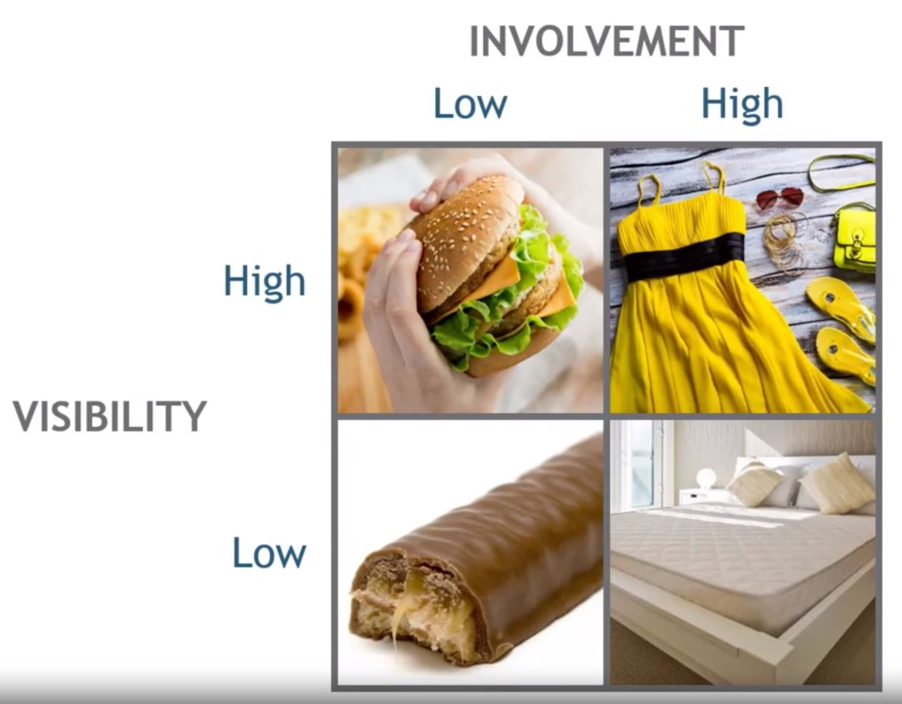

## 1. Low Involvement, Low Visibility

- Price thresholds

- Price insentive below threshold

- Price takes a back seat to conveniece

## 2. Low Involvement, High Visibility

- Price thresholds

- Price important for reat purchases

- Deal seeking

## 3. High Involvement, Low Visibility

- Price impacts consideration set

- Price weighted against other attributes

- Extensive price search possible

## 4. High Involvement, High Visibility

- Price impacts consideration set

- Extensive Price search

- Price may become part of the consumption value

## 5. Price and Process

- The more involved the buying process, the longer the buyer will consider price
    - Pay attention to price search
        - Search Engine Optimization (SEO)
        - Advertise price

    - Consider "Mental Accounting" type deals
        - Customers are trading off attributes and price
        - Different customers make different trade-offs

    
- The more visible the consumption, the more likely it is that price is part of the intrinstic value of the object
    - High prices - or low prices - may be consistent with buyers' self-image
    - Sam Walton and his pick-up truck
    - Veblen goods: money-burning
    