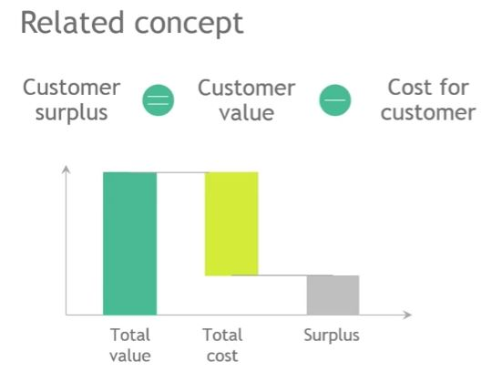
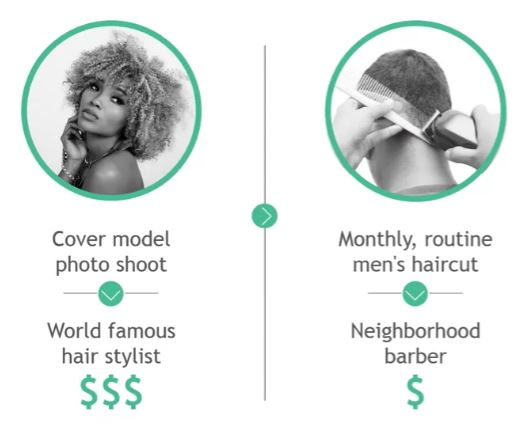

## 1. What is Customer Value?

- Customer Value Equation
    - Customer Value = $\sum Value-drivers_i$
    - Customer Value = Value of next bestalternative + Net Value of differences to next best alternative

## 2. Customer Surplus

## 3. Value-drivers

- Technical - stuff, performance
- Functional - experiences
- Emotional - satisfaction

## 4. Technical Value Drivers

- Technical 
    - Product features that provide technical benefits. Connect to functional and emotional benefits

- Product value drivers
    - Speed
    - Meals
    - Space
    - WiFi Access

- Non-product value drivers
    - Cancellation policy

## 5. Functional value drivers

- Functional
    - How the customer experiences product during purchase, set-up, usage

- Product value drivers
    - Ease of booking
    - Convenience during trip
- Non-product value drivers
    - Customer service
    - Value-added services
    
## 6. Emotional Value Drivers

- Emotional
    - How the customer feels about product based on his brand perception, its reputation, and their personal experience

- Product value drivers
    - Brand
    - Prestige

- Non-product value drivers
    - Courtesy of staff
    - Trust 

## 7. Customer value varies

- Varies by customer depending on 
    - Needs, wants, fears
    - Willingness / ability to pay
    - Context of purchase

## 8. Why do customers value the "same" service so differently?

