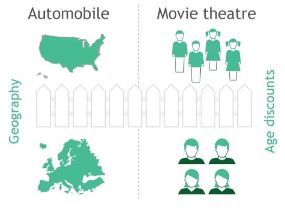
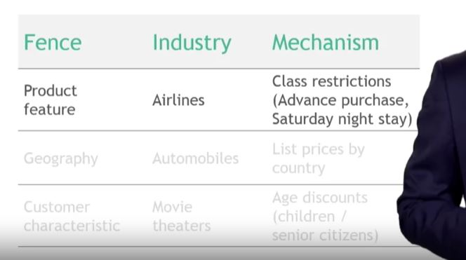

## Group customer into segments with similar value drivers

- $\sum Value-drivers_i$
    - Address similar needs and wants
    - Price in line with willingness to pay
    - Market and sell effectively

## 2. Use price fences to differentiate price by customer segment

## 3. What makes effective price fences?

## 4. Two tactics to manage what customers pay

- Avoid 
    - "trading down" by removing features critical to a segment

- Encourage
    - "trading up" by emphasizing incremental benefits and additional incentives

## 5. Key Steps for differentiating customer value segments

1. Understand the customer value in business provides

2. Articulate how the value drivers differ by customer segment

3. Differentiate your offering to maximize value for your target segment and price accordingly

