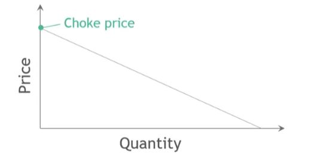
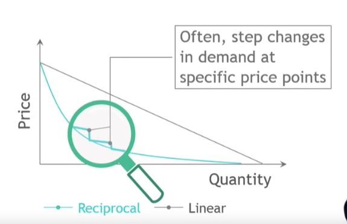
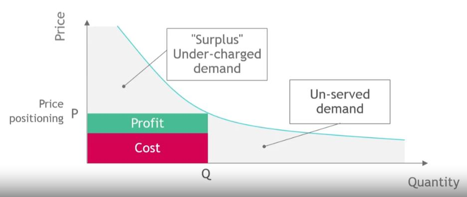
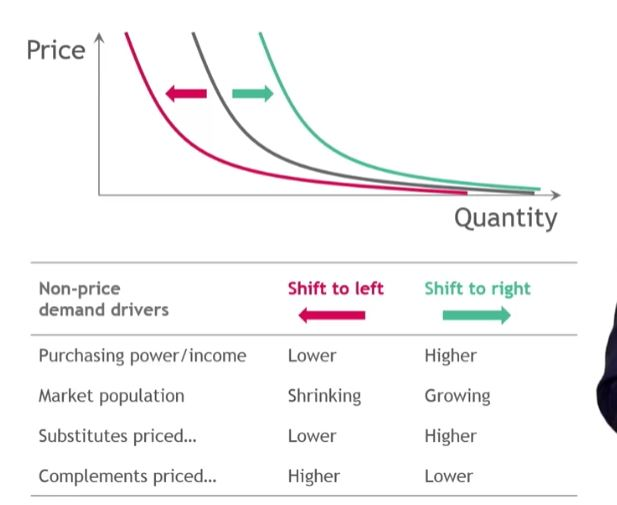

## 1. Willingness to pay (WTP)

- Definition
    - The maximum amount of money a customer is willing to pay for a product or service
    - The price at or below a customer will buy a product or service

- Customers MUST BE ready, willing and able to spend
- Customers with "hypothetical WTP" DO NOT count
- WTP is highly context sensitive, ties back to customer value equation
- Measuring willingness to pay important, but difficult!

## 2. Demand curve - recap

- Plot of quantity along WTP for an individual, segment, and market

- Law of demand:
    - Demand goes up when prices go down

## 3. Demand curve - shapes

## 4. Show me the money!

## 5. Non-Price demand drivers

## 6. Demand curve - tips

- Be aware when working with demand curves!

    - Demand curves do not account for non-price determinant demand curves
    - Demand cuurves can chage (over time but also quite quickly)
    - Rarely linear

- Still, a very important and useful concept!

## 7. Questions I think about for all client cases

- What is the most and the least a segment is willing to pay?

- How might WTP change if a client's product positioned differently?

- What shape does the demand curve most likely have?

- At what price points should clients expect step-changes in demand?

- Is the client making the optimal trade-off between under-charged and un-served demand?
