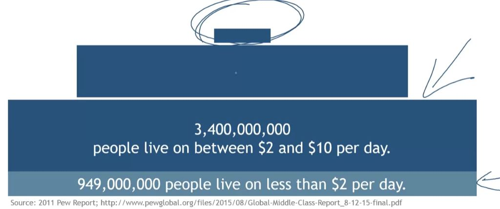
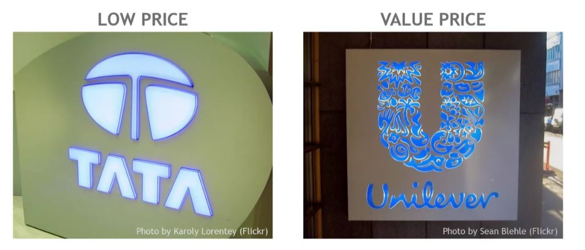

## 1. The Income Inequality Pyramid

## 2. Risks at the Bottom of the Pyramid

- Exploitation

- Brand

- Cannibalization

- Local competitive reactions

## 3. Is the bottom of the pyramid really for you?

- Can you manage high volume of low-value transacitons?

    - Are production and distribution systems suitable?

- Can you work with informal markets?

- Can you keep out legacy and overhead costs?

- Do your leaders have a long-range mindset?

## 4. Two Firms, Two Approaches

