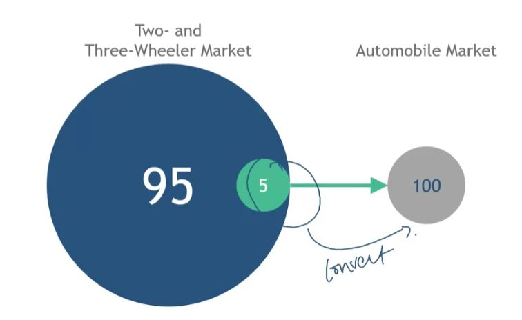

## 1. India

- Emerging economy
- Growing middle class
- Large population "at the bottom of the pyramid"
    - $6,200 (2015) per capita average annual income

## 2. India's Automobile Market: 2004

- One of the largest, fastest-growing in the world
    - ~25% annual Growth
    - ~12% growth in exports annually
        - Exporting 300,000+ cars

- Out of reach for many
    - $2,910 average cost
    - Higher variable costs (fuel, maintenance, parts)

## 3. India's Two & Three-Wheeler Market:2004
- Second largest in the world
    - Exporting 1,000,000/year
    - Selling close to 8,000,000/year!

- Attractive for many reasons
    - Average cost: $552
    - Lower variable costs (fuel, maintenance, parts)

## 4. Tata Motors: Up for the challenge?

- 6th largest automobile company in the world
- First Indian manufacturing company to be listed on the New York Stock Exchange
- Acquired premium brands: Land Rover & Jaguar
- Focused on economy cars: Indica, Indigo, Ace
- Major exporter of economy cars to Asia and Africa

## 5. Tata sees on opportunity!

## 6. The Idea for a Super Economy Car

- Set price at $2,500

- Forego features
    - AC, Power Steering, Power Windows, Tachometer, Dual Windshield Wipers

- Streamline design
    - Modular components produced at different sites for local manufacture
    - Components serve more than one function

## 7. The result? The Tata Nano!

## 8. So, What happened?

- Couldn't quite hit the target price point

- Mismatched advertising (online, flashy showrooms) and their audience (markets, shops, bazaars)

- Sales were less than stellar
    - Launched in Myanmar, Sri Lanka, and Nepal with similar results
    - As of Jan 2015, sales limited to ~ 1,300 units/month

## 9. Takeaways from Tata's Experience with the Nano

- Low price point innovation is only the beginning

- Go-to-Market has its own challenges
    - Perception of cheap vs aspiration
    - Support systems - financing, dealers, maintenance

- Need to innovate on all four pillars of the marketing mix (product, price, place, promotion)

