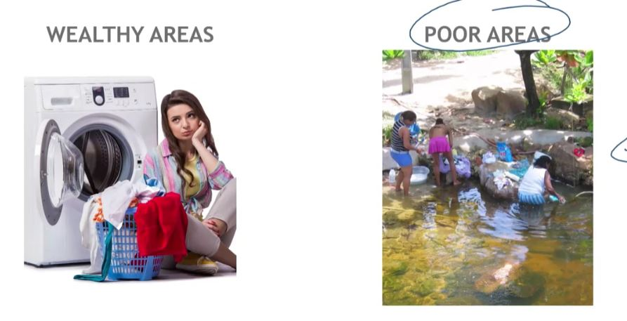
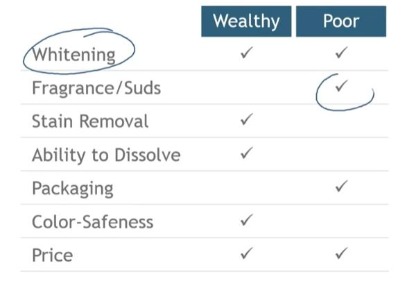

## 1. Brazil: Economy Varies by Region

- Northeast:
    - Large population "at the bottom of the pyramid"

- South:
    - Growing middle class
    - Established wealthy population

## 2. Same Task, Different Approaches

## 3. Different Segments, Different Priorities

## 3. Unilever's Existing Product Line

- Designed for use in washing machines
    - Large packaging
    - Effective stain removal

- Competes at the higher end of northeastern Brazil market with its Omo brand

## 4. Unilever sees an opportunity!

- Change the formula
- Eliminate ingredients that add nothing for hand-washing or the target consumer
- Improve whitening power and perfume
- Lower the price and gain market share from competition more than from Omo
- Create a simple name : ALA
- Package for usage style
    - Cheap plastic bags that protect from humidity
    - Organize to draw attention and for fade resistance
    - Small size
- Priced to fit bucket
    - Small package size

## 5. So, What happened?

- ALA market share grew to almost 20% in 12 years
    - Market expanded to South Eastern Brazil

- Omo's share of the market declined by 11%

## 6. Conclusion

- Is it possible to extract value from the bottom of the world market? YES

## 7. Takeaways from Unilever's Experience with Ala

- Position products as especially made to meet the needs of the low income consumers
- Avoid the common mistake of assuming low income consumers mean cheaper products

