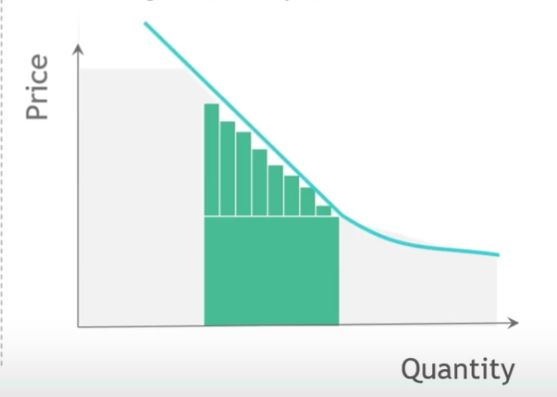

## 1. How do you price to the demand curve?

## 2. Demand curve - revenue with single offering

## 3. Demand curve - maximum theoretical revenue

## 4. Price to demand curve by selling to multiple customer segments

## 5. How many customer segments should you serve?

- Better Question:
    - What does it take to serve a customer segment?
        
        - Deep Customer Understanding
            - Differentiate customer value equations
            - Identify Segments
            - Articulate winning value proposition
        
        - Capabilities and Assets
            - ... to deliver the value propostiion
            - Examples
                - Technology
                - Capacity
                - Brand

        - Access to customers
            - Reach each segment effectively
            - Market efficiently
            - Sell through the right channels

        - Enabling economics
            - Favorable cost structure
            - Critical mass in each segment for scale
            - Sufficient pricing power

    - As many segments as you can effectively serve profitably!

## 6. Even within a segment, there is room to optimize...

## 7. Create segments first, then use sub-segments to price to demand curve

1. Create distinct customer segments

2. Identify sub-segments within segments to price to WTP

