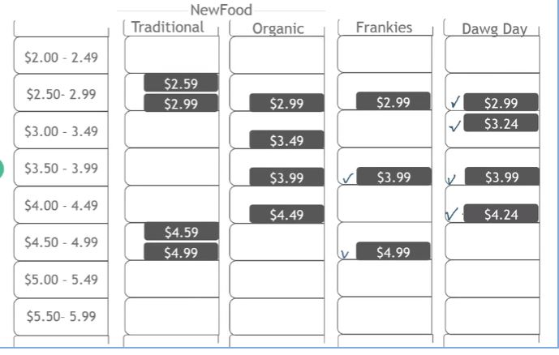
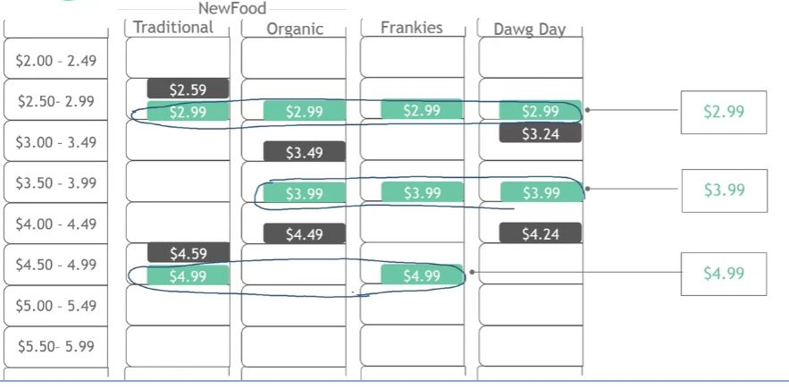
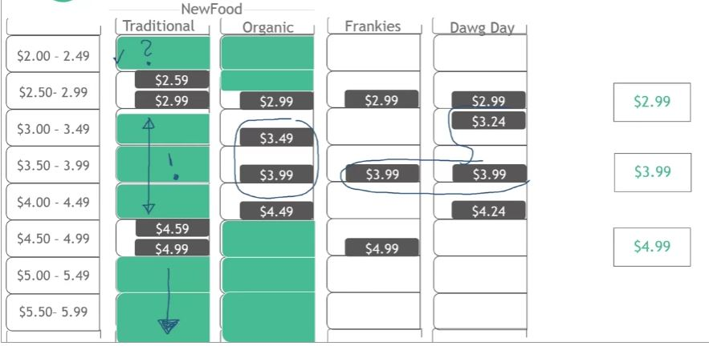
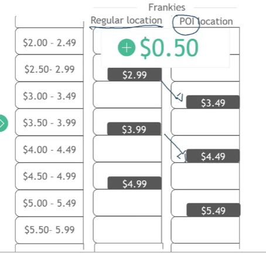
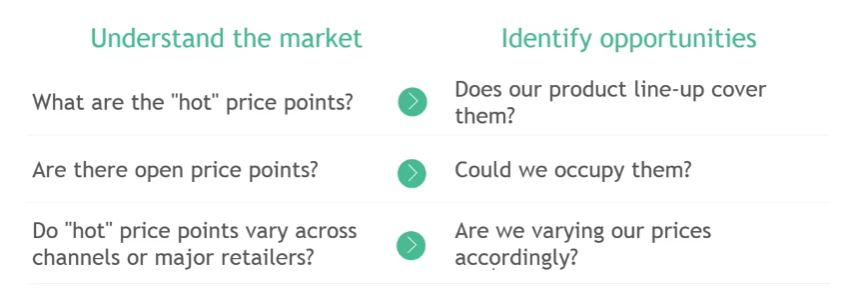

## 1. A discussion with the CEO of NewFood

- CEO Says "I wonder how well we price to demand ... actually I'm pretty sure we are miissing out"

- Fast food chain
- 1,000 stores, $800M sales
- Primary product: Hot dogs
- Two product lines
    - Traditional (~60%)
    - Orgnanic (~40%)
- Two direct competitors
    - "Frankies"
    - "Dawg Day"

## 2. Pricing experts rely on these three techniques

- Price piano
    - Understand "hot" price points in the market

- Price ladder
    - Systematically differentiate products and prices

- Incentive curve
    - Optimize package sizes and price per use

## 3. Price Piano

- Price Piano
    - Framework to understand a market, identify opportunities, and discover "hot" price points

1. Determine price range

2. Map product line-up

3. Map competitor line-up

4. Find the "hot" price points

5. Find the open price points

6. Map prices by channels

## 4. Price pianos are about "hot" price points and opportunities

