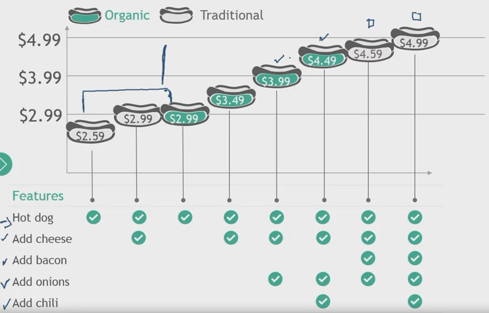
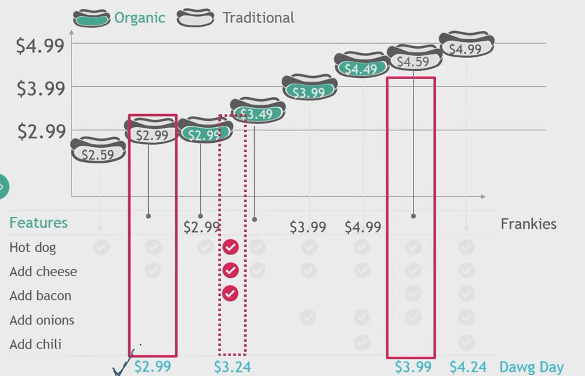
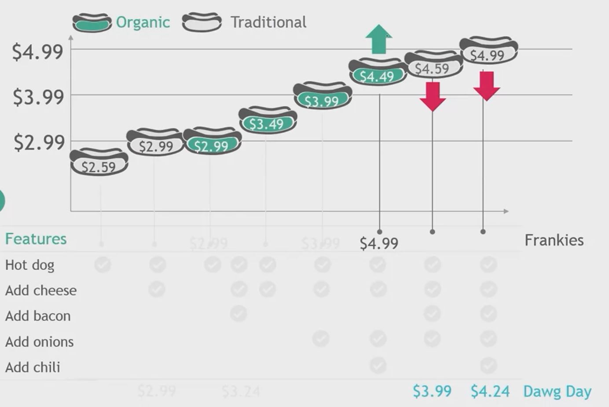
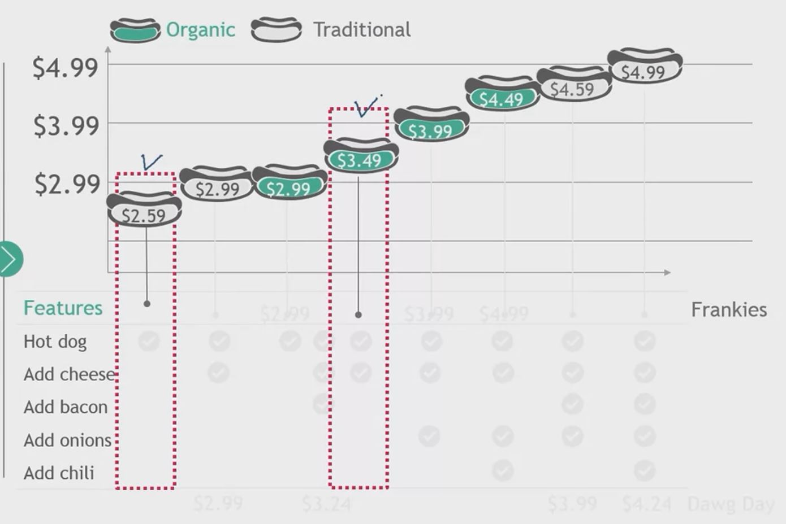
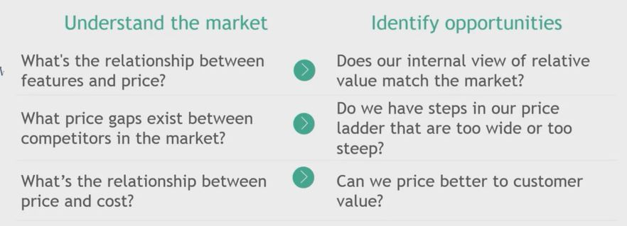

## 1. Price Ladder

- Price Ladder
    - A way to identify the steps between price points and assess if the steps are too wide or too steep

1. Plot product line-up

2. Map features of each product

    

3. Include Competitors

    

4. Analyze the price ladder

    - Look for a big price of feature gap

        

    - Look for re-price oppportunities

        

    - Defend the unique positions

        

## 2. Price ladders are about product and price differentiation

