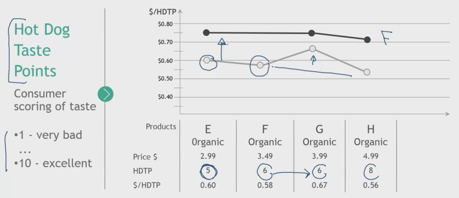
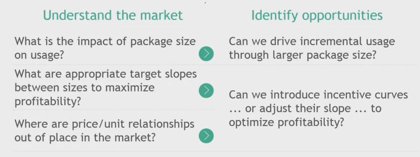

## 1. Incentive Curve - quick recap

- Price/Unit
    - Example for units:
        - Grams/ounces
        - Liters/gallons
        - Count

- Hot Dog Taste Points

    

## 2. Incentive curves are about package size and price per use

