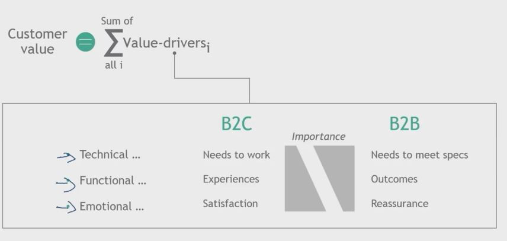

## 1. How would you price this laptop in line with customer value?

## 2. Value drivers are different B2C vs B2C

## 3. How businesses think about your price

- "Your price" is "their cost"
    - B2B Customers have desire to maximize surplus (i.e benefits - cost)

- Investment mindset ... expecting adequate returns

- Total cost of ownership considered for durables

- Ease of doing business important

## 4. What do B2B customers really want?

- Success as business
    - Achieve competitive advantage
    - Drive growth in top and bottom line
    - Deliver adequate capital returns

- How does your offering contribute to these goals?
