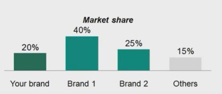
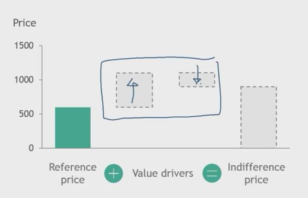

## 1. Five steps to set value-based prices for new products

1. Define target customer segment

2. Identify next best alternative

3. Identify the customer's value drivers

4. Quantify value drivers to find the indifference price point

5. Use the indifference price point to set the price

## 2. Define target customer segment

1. Know your customer

    - Jane (Typical home user)
        - Watching movies in 3D
        - Large enough screen size
        - Appealing brand
        
        - Her usage requires fewer technical benefits

    - Raj (IT Director)
        - Security
        - Durability
        - Processing power
        - Storage capacity
        
        - Needs technical specs to maximize user productivity

    - Activities to analyze markets
        - Store visits
        - Competitive mapping
        - Customer Interviews
        - Quantitative surveys

2. Know your competitors

    - What other brands and product offerings compete for Jane's business?

    

## 3. Identify next best alternative

1. What is the next best alternative?
    - Customers looking to buy a product usually have a specific product in mind: the next best alternative

    - The price of this product represents the reference price

        

2. Compare products with similar defining features

    - Relevant for your target customer segment

    - Compare key features with competing products

    - Try to anchor to the market leader

        

3. For products with market leading features

    - Reference price points NOT AVAILABLE without directly comparable products
    - Build the target customers' next best alternative by combining products and services which provide the exact same value

    - Aggregate prices of individual elements to "build" price

    