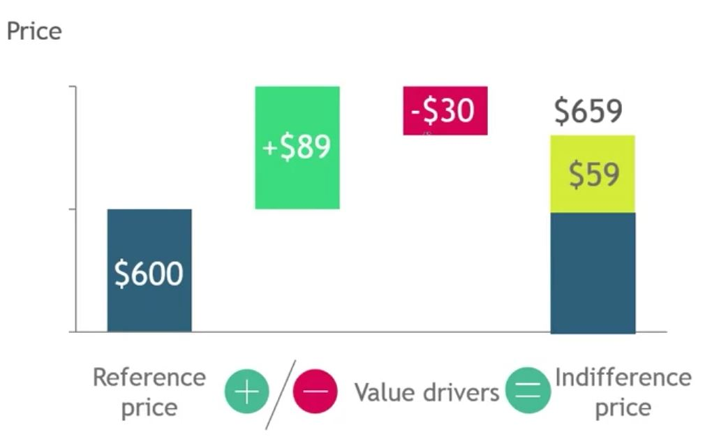

## 1. Identify value drivers to find the indifference price point

1. Customer benefit equals sum of value drivers
- Value drivers measure the value customers associate with each product feature

    

- Technical
    - Product features that provide technical benefits. Connect to functional and emotional benefits

    - Product value drivers
        - Size
        - Performance
        - Capacity

    - Non-product value drivers
        - Warranty duration

- Functional
    - How the customer experiences product during purchase, set-up, usage

    - Product value drivers
        - Ease of use
        - Breadth of functions

    - Non-product value drivers
        - Delivery speed
        - Customer service
        - Value-added services

- Emotional
    - How the customer feels about product based on his brand perception, its reputation and their personal experience

    - Product value drivers
        - Brand
        - Design

    - Non-product value drivers
        - Courtesy
        - Trust

2. How well do we meet Jane's needs?
    - Value drivers can have both positive and negative impacts
    
        

3. Three main quantification methods
    - Economic value estimate
    - Intrinsic value analysis
    - Conjoint analysis

        

        

## 2. Quantify value drivers to find the indifference price point

1. Indifference price
    - Price at which Jane would be indifferent whether she buys our product or her next best alternative

        

        

## 3. Use the indifference price point to set the price

- Justifiable price range
    - Range above product cost and indifference price

        

    

- Calculate gross margin for each price point
    - Leveraging demand curve

        

- Profit parabola will lead to optimal price

    - Plot gross margins for each price point and find maximum
    
        

- In the real world, pricing decisions always consider all three lenses
    - Customer value
    - Economic
    - Competitive
    