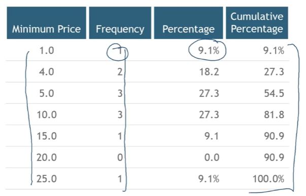
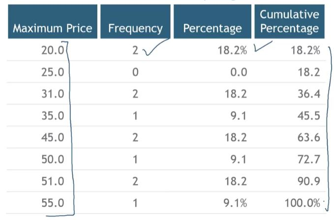
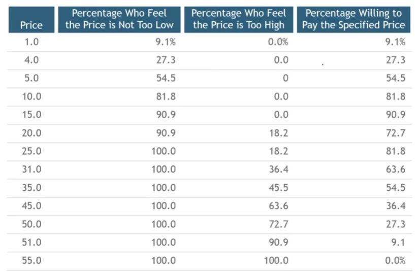

## 1. How do you adjust surveys? (1)

- "At what price would this product be so inexpensive that you would doubt its quality?"

## 2. Sample Responses: Minimum Price

## 3. How do you adjust surveys? (2)

- "At what price would this product be so expensive that it wouldn't be worth it?"

## 4. Sample Responses: Price at Which Product Is Not Worth Buying

## 5. Samples Responses: Combined Data

