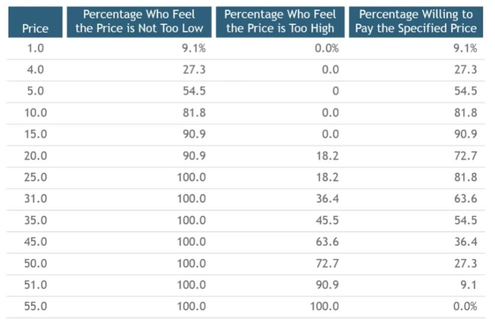
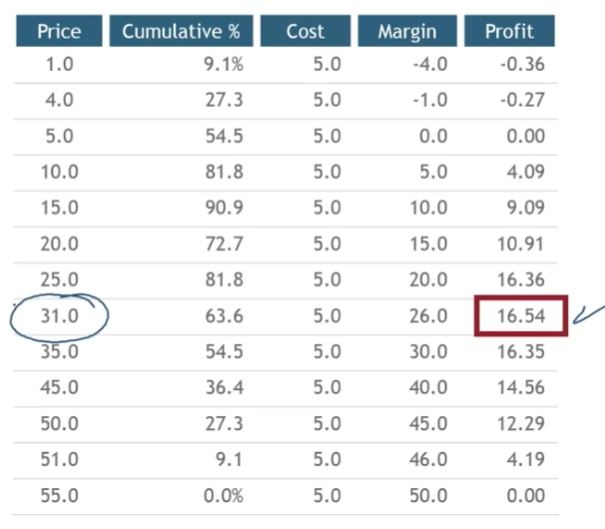

## 1. Sample Responses: Combined Data

## 2. Sample Responses: Combined Data

## 3. Still Problems with Surveys

- Increases the importance of price in the minds of respondents
- Isolates price from other attirubtes
- Solution: Conjoint Analysis

