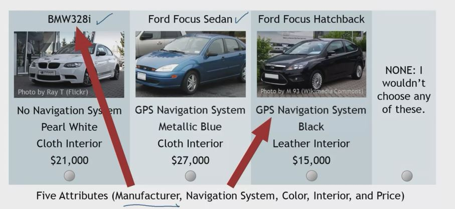

## 1. How does conjoint work?

- Show customers a series of hypothetical products defined by their attributes

- Ask the respondent to pick the product they like the best

- Repeat 20~30 times

- Use responses to estimate attribute-level utilites

## 2. A Car Purchase!

## 3. Step1 - Define Attribute List

- Select most important determinanats of choice
- Assure independence (brand, price, color, etc.)
- Define by different levels

## 4. Step4 - Formulate Levels

- Concrete and unambiguous
    - "Very Expnensive" vs "250"
    - "Powerful" vs "280 Horsepower"
- Mutually Exclusive
    - Range = 5000 miles,
      Range = 6000 miles

## 5. Step3 - Collect Data

- Via web-based experiments
- Recommend >= 500 respondents
- <= 30 questions per person
- Collect individual-level information to aid segmentation decisions

