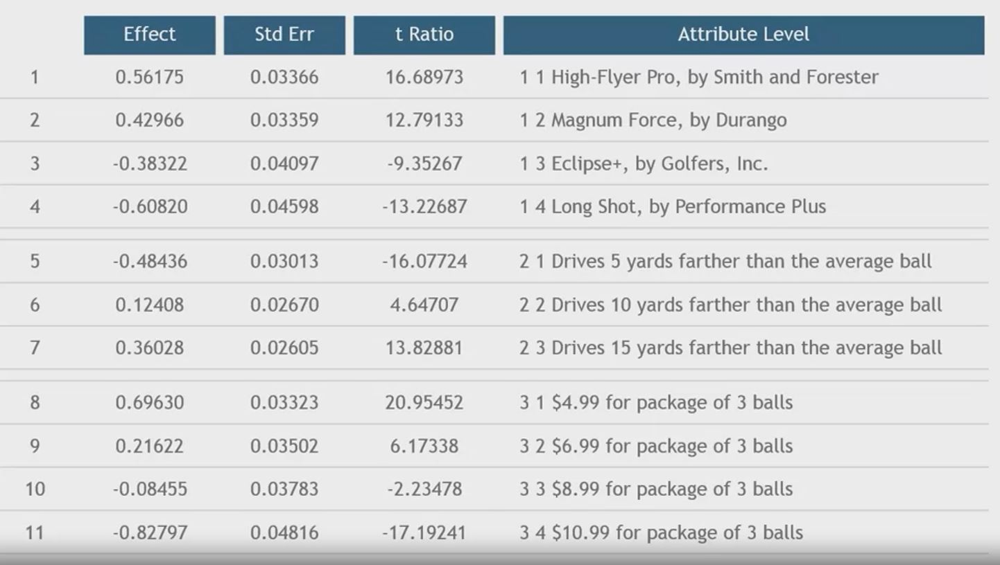

## 1. Step4 - Interpret Conjoint Results

## 2. So What can you do with this?

- Determine which product people prefer
- Look at the trade-offs among different possible features
- Determine the ranking of attributes in determining choice
- Compute willingness to pay for design changes
- Do Propensity Modeling

## 3. Example 1 - Product Preference

1. Product1 
- High-Flyer = .56
- 5 yards further = -.48
- $6.99 per pack = .22
- Total Utility = .30

2. Product2
- Long Shot = -.61
- 15 yerds further = .36
- $8.99 per pack = -.08

- Total Utility = -.33
