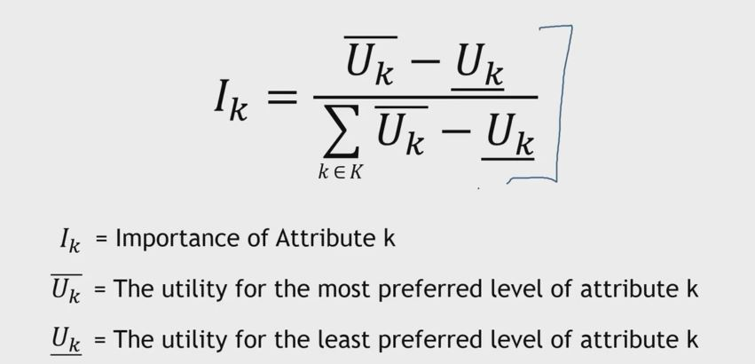

## 1. Example 3 - Attribute Importances

## 2. Example 3 Applied to Data

- In our golf ball example the attribute importance of "Distance" is

- (.36 + .48) / ((.36 + .48) + (.56 + .61) + (.70 + .83)) = .24

- So "Distance" receives 24% of the decision weight

